# ケース別 技術スタック＆周辺ツール選定ガイド

作成：2026年9月　／　前提：PHPは選択肢から除外

---

## このドキュメントの使い方

各カテゴリで **既定（迷ったらこれ）** を1つに絞り、**代替** には「どんな条件なら乗り換えるか」を書いている。案件ごとに調べ直すのではなく、既定を採用し、条件に当てはまるときだけ代替に切り替える運用を想定している。

バージョン番号は陳腐化が早いため記載していない。採用時は各ツールの最新安定版を使う。

選定の根拠と、よくある疑問への回答は §22 にまとめている。

### 選定の進め方

作るものが決まったら、次の順に見ていく（HTML版では冒頭の選定ウィザードで1〜2をまとめて確認できる）。

1. **言語を決める**：§2-9（作成物ごと）と §2-10（バックエンドの負荷の性質）で決める。
2. **構成を決める**：§19 から近いケースを選び、構成図と表で全体像を確認する。
3. **規模を確かめる**：§23 の目安の数値で、想定規模に対して構成が過剰・不足でないかを確認する。
4. **出口を確かめる**：§24 の移行パスで、成長したときの次の一手と、今のうちにやっておく備えを確認する。
5. **費用の膨らみ方を確かめる**：§25 で、採用するサービスの課金の仕組みと注意点を確認する。
6. **習熟度を確かめる**：§27 で未経験のツールが含まれていないかを確認し、含まれていれば検証期間を見積もりに入れる。
7. **作り始める**：§26 のコマンドで雛形を作り、§21 のチェックリストを埋める。

### 選定の原則

1. **1カテゴリ1ツール**：同じ役割のツールを混在させない（例：ESLintとBiomeを併用しない）。
2. **マネージド優先**：自前運用は、コスト・データ所在・オンプレ要件のいずれかで必要になったときだけ選ぶ。
3. **PostgreSQLを軸にする**：キュー、全文検索、ベクトル検索も、まずPostgresで足りるかを検討する。
4. **標準に寄せる**：OpenTelemetry、OpenAPI、OCIイメージなど、ベンダーに依存しない規格を優先する。
5. **根拠を説明できること**：利用者が多く、ドキュメントが厚く、採用理由を第三者に説明できるツールを選ぶ（§22）。

---

## 1. 開発環境（言語共通）

| 役割 | 既定 | 代替と乗り換え条件 |
|---|---|---|
| 言語バージョン管理 | **mise**（Node、Go、Ruby、Python、Rust、Terraformを1本で管理。`.mise.toml`をリポジトリに置く） | asdf：既存プロジェクトが使っている場合のみ |
| 環境変数（ローカル） | **mise の `[env]`**、または `.env`＋dotenv | direnv：mise を使わない場合 |
| ローカルのミドルウェア | **Docker Compose**（Postgres、Redis/Valkey、Mailpit、MinIOなど） | — |
| 開発コンテナ | 使わない（ホスト＋mise で十分） | Dev Containers：チームの環境差異が問題になったとき |
| ローカルのメール確認 | **Mailpit** | — （MailHogは開発停止のため選ばない） |
| ローカルのS3互換 | **MinIO** | LocalStack：SQS/SNSなどAWSサービスを広くモックしたいとき |
| Gitフック | **lefthook**（言語非依存・高速・並列実行） | husky：Node単体のリポジトリで慣れている場合 |
| コミット規約 | **Conventional Commits** | — |
| エディタ設定共有 | **.editorconfig** ＋ 各言語のフォーマッタ設定 | — |

### 推奨ディレクトリ直下ファイル（全案件共通）

```
.mise.toml          # 言語・ツールのバージョン
.editorconfig
compose.yaml        # ローカルのミドルウェア
lefthook.yml
.github/workflows/
.github/renovate.json（または renovate.json）
docs/adr/           # 設計判断の記録
README.md
```

---

## 2. 言語別の既定セット

### 2-1. TypeScript（Node.js）

| 役割 | 既定 | 代替と乗り換え条件 |
|---|---|---|
| ランタイム | **Node.js（LTS）** | Bun：スクリプト・CLI・新規の小規模APIで速度を重視するとき。Deno：Deno Deploy前提のとき |
| パッケージマネージャ | **pnpm** | Bun：ランタイムもBunにする場合 |
| モノレポ | **pnpm workspaces ＋ Turborepo** | Nx：大規模でコード生成や依存グラフの可視化が必要なとき |
| Lint＋フォーマット | **Biome**（1ツールで完結・高速） | ESLint（flat config）＋typescript-eslint＋Prettier：Biomeが未対応のルールやプラグイン（Next.js固有ルールなど）が必須のとき |
| 型チェック | **tsc --noEmit**（`strict: true`） | — |
| テスト（ユニット） | **Vitest** | Jest：既存プロジェクトのみ |
| テスト（E2E） | **Playwright** | — |
| APIモック | **MSW** | — |
| バリデーション | **Zod** | Valibot：バンドルサイズを極限まで削りたいフロント |
| HTTPフレームワーク | **Hono**（軽量・どこでも動く・型安全なRPC） | NestJS：10人以上のチームでDI・モジュール構造を強制したいとき。Fastify：Node専用で既存プラグイン資産を使いたいとき |
| ORM／クエリ | **Drizzle**（SQLに近い・軽い・エッジ対応） | Prisma：スキーマ駆動でGUI（Studio）やマイグレーションの手厚さを重視するとき。Kysely：ORMを使わず型付きクエリビルダーだけ欲しいとき |
| マイグレーション | **drizzle-kit** | Prisma Migrate（Prisma採用時） |
| ジョブキュー | **BullMQ**（Redis/Valkey） | Inngest／Trigger.dev：サーバーレス環境でワークフロー（リトライ・待機・ステップ実行）が必要なとき。pg-boss：Redisを増やしたくないとき |
| ロギング | **pino** | — |
| 設定・環境変数の検証 | **Zodでスキーマ定義して起動時に検証**（t3-envなど） | — |
| 日付 | **date-fns** | Temporal API：対応環境が揃っていればネイティブを使う。Day.js：軽さ最優先 |
| HTTPクライアント | **fetch（標準）** | ky：リトライやフックを簡潔に書きたいとき |
| ビルド（ライブラリ） | **tsup** | tsdown：新規で試せる場合 |
| 実行（開発時） | **tsx** | — |
| 脆弱性チェック | **pnpm audit ＋ Renovate/Dependabot** | — |

### 2-2. Go

| 役割 | 既定 | 代替と乗り換え条件 |
|---|---|---|
| 依存管理 | **Go modules** | — |
| Lint | **golangci-lint**（設定ファイルで有効ルールを明示） | — |
| フォーマット | **gofumpt**（gofmtより厳格） | gofmt：チームに合わせる場合 |
| HTTPルーティング | **標準 net/http**（メソッド・パスパラメータ対応済み）＋ ミドルウェアは自前か小さなライブラリ | chi：ミドルウェアのエコシステムを使いたいとき。Echo：フレームワーク一式を求めるチーム |
| DBドライバ | **pgx** | — |
| クエリ | **sqlc**（SQLから型安全なコードを生成） | GORM：採用しない（暗黙の挙動が多く、パフォーマンス問題の調査が困難）。ent：グラフ構造のスキーマが中心のとき |
| マイグレーション | **goose** | Atlas：宣言的スキーマ管理（あるべき状態から差分生成）をしたいとき。golang-migrate：既存プロジェクト |
| OpenAPI | **oapi-codegen**（スキーマファースト） | ogen：生成コードの性能・厳密さを重視するとき |
| RPC | **Connect（connect-go）** | gRPC：既存のgRPC基盤がある場合 |
| ジョブキュー | **River**（Postgresベース、トランザクション内でジョブ投入可能） | Asynq：Redis前提のとき |
| ロギング | **log/slog（標準）** | — |
| 設定 | **環境変数＋envconfig（caarlos0/env など）** | koanf：複数ソース（ファイル・環境変数・リモート）を統合したいとき |
| CLI | **Cobra** | urfave/cli：小規模CLI |
| テスト | **標準 testing ＋ go-cmp** | testify：アサーションを簡潔にしたいチーム |
| 統合テスト | **testcontainers-go**（実DBでテスト） | — |
| モック | **インターフェース＋手書きフェイク** | mockery／gomock：モック対象が多いとき |
| ホットリロード | **air** | — |
| 脆弱性チェック | **govulncheck** | — |
| リリース | **GoReleaser** | — |

### 2-3. Ruby / Rails

Rails 8の標準構成（「Rails omakase」）にできるだけ乗る。外部依存を増やさないことが最大のメリットになる。

| 役割 | 既定 | 代替と乗り換え条件 |
|---|---|---|
| バージョン管理 | **mise** | rbenv：既存環境 |
| 依存管理 | **Bundler** | — |
| Lint＋フォーマット | **RuboCop（rubocop-rails-omakase）** | Standard：設定を一切考えたくないとき |
| テスト | **Minitest（Rails標準）＋ fixtures** | RSpec＋FactoryBot：チームがRSpecに慣れている、または既存資産があるとき |
| システムテスト | **Capybara＋Selenium（Rails標準）** | Playwright（capybara-playwright-driver）：安定性・速度を重視するとき |
| フロント | **Hotwire（Turbo＋Stimulus）＋ importmap** | jsbundling＋esbuild：npmパッケージを多く使うとき |
| CSS | **tailwindcss-rails** | — |
| アセット | **Propshaft（Rails 8標準）** | — |
| コンポーネント | **ViewComponent** | Phlex：Rubyだけでビューを書きたいとき |
| ジョブ | **Solid Queue**（DBベース） | Sidekiq：非常に高スループットが必要なとき |
| キャッシュ | **Solid Cache** | Redis：既存のRedis基盤がある場合 |
| WebSocket | **Action Cable＋Solid Cable** | AnyCable：同時接続数が非常に多いとき |
| 認証 | **Rails 8の認証ジェネレータ** | Devise：OAuth連携・多要素認証など機能を一式揃えたいとき。Rodauth：高度なセキュリティ要件 |
| 認可 | **Pundit** | Action Policy：ルールが複雑でキャッシュやテスト支援が欲しいとき |
| 管理画面 | **Avo** | Administrate：無償・シンプルで足りるとき |
| ページネーション | **Pagy** | — |
| ファイル | **Active Storage** | — |
| デプロイ | **Kamal** | Render／Fly.io：サーバー管理をしたくないとき |
| セキュリティ静的解析 | **Brakeman** | — |
| 依存の脆弱性 | **bundler-audit** | — |
| N+1検出 | **Prosopite** | Bullet |
| モバイル | **Hotwire Native** | React Native：ネイティブ体験を重視するとき |

### 2-4. Python（AI/ML、データ処理が必要な場合に限定）

| 役割 | 既定 | 代替と乗り換え条件 |
|---|---|---|
| バージョン・依存管理 | **uv**（Python本体の導入からロックファイルまで1本） | Poetry：既存プロジェクト |
| Lint＋フォーマット | **Ruff** | — |
| 型チェック | **Pyright**（またはmypy） | — |
| テスト | **pytest** | — |
| Webフレームワーク | **FastAPI** | Django：管理画面付きのCRUDアプリをPythonで作る必要があるとき |
| バリデーション | **Pydantic** | — |
| ORM | **SQLAlchemy（2.x形式）** | SQLModel：FastAPIと密に統合したい小規模案件 |
| マイグレーション | **Alembic** | — |
| HTTPクライアント | **httpx** | — |
| ジョブ | **Celery** | arq／Dramatiq：軽量に済ませたいとき。Temporal：長時間ワークフロー |
| ロギング | **structlog** | — |
| データ処理 | **Polars** | pandas：ライブラリ連携上必要なとき |
| ノートブック | **Jupyter** | marimo：Gitで差分管理しやすいノートブックが欲しいとき |

### 2-5. Rust

| 役割 | 既定 | 代替と乗り換え条件 |
|---|---|---|
| ビルド・依存 | **Cargo** | — |
| Lint／フォーマット | **clippy ／ rustfmt** | — |
| 非同期ランタイム | **Tokio** | — |
| Webフレームワーク | **axum** | Actix Web：既存資産がある場合 |
| DB | **sqlx** | SeaORM：ORMが欲しいとき |
| シリアライズ | **serde** | — |
| ロギング／トレース | **tracing** | — |
| CLI | **clap** | — |
| エラー | **thiserror（ライブラリ）／ anyhow（アプリ）** | — |
| テスト実行 | **cargo-nextest** | — |
| ベンチマーク | **criterion** | divan：記述を簡潔にしたいとき |
| 脆弱性チェック | **cargo-audit ／ cargo-deny** | — |
| バイナリ配布 | **cargo-dist** | GoReleaser（Rust対応あり）：Goと配布の仕組みを揃えたいとき |
| クロスコンパイル | **cargo-zigbuild** | cross：Dockerで環境ごと切り替えたいとき |
| WebAssembly | **wasm-bindgen＋wasm-pack** | — |
| Node.jsから呼ぶネイティブ拡張 | **napi-rs** | — |
| Pythonから呼ぶネイティブ拡張 | **PyO3＋maturin** | — |
| デスクトップアプリ | **Tauri**（UIはWeb技術、裏側はRust） | Electron：Node.jsのAPIやChromiumの挙動に強く依存するとき |
| 組み込み（非同期） | **Embassy** | RTIC：割り込み駆動で厳密なリアルタイム性が必要なとき |
| gRPC | **tonic** | — |

### 2-6. Kotlin（JVM）

既存のJava資産との連携、複雑な業務ルール、大規模バッチ、Kafkaなどのストリーム処理で選ぶ。

| 役割 | 既定 | 代替と乗り換え条件 |
|---|---|---|
| JDK | **Eclipse Temurin（LTS）をmiseで管理** | Amazon Corretto：AWS上での実行に揃えたいとき |
| ビルド | **Gradle（Kotlin DSL）** | Maven：既存プロジェクト |
| Lint／フォーマット | **ktlint ＋ detekt** | — |
| Webフレームワーク | **Spring Boot** | Ktor：軽量に作りたい、Springの規模が過剰なとき |
| DBアクセス | **jOOQ**（SQLに近い型安全なクエリ） | Spring Data JPA：単純なCRUDが大半のとき。Exposed：Kotlinらしく書きたい小〜中規模 |
| マイグレーション | **Flyway** | Liquibase：DBの種類を横断して管理したいとき |
| 非同期 | **Kotlinコルーチン** | — |
| シリアライズ | **Jackson（Spring標準）** | kotlinx.serialization：Ktor採用時 |
| テスト | **JUnit 5 ＋ Kotest（アサーション）＋ MockK** | — |
| 統合テスト | **Testcontainers** | — |
| バッチ | **Spring Batch** | — |
| ストリーム処理 | **Spring for Apache Kafka** | Kafka Streams：状態を持つ集計処理 |
| OpenAPI | **springdoc-openapi** | — |
| ロギング | **SLF4J＋Logback（JSON出力）** | — |
| コンテナ化 | **Jib**（Dockerfileなしでイメージ作成） | Dockerfile：細かく制御したいとき |
| 起動速度の改善 | 通常は不要 | GraalVMネイティブイメージ：サーバーレスで起動時間が問題になるとき |

### 2-7. Elixir（BEAM）

大量の常時接続、プレゼンス（誰がオンラインか）、障害からの自動復旧が中心の常駐サービスで選ぶ。

| 役割 | 既定 | 代替と乗り換え条件 |
|---|---|---|
| バージョン管理 | **mise（Erlang／Elixir）** | — |
| ビルド・依存 | **Mix ＋ Hex** | — |
| フォーマット | **mix format** | — |
| Lint | **Credo** | — |
| 型チェック | **Dialyxir**（Elixir本体の型システムも段階的に強化中） | — |
| Webフレームワーク | **Phoenix** | Plug単体：APIだけの極小サービス |
| 画面 | **Phoenix LiveView**（サーバー主導でリアルタイムUI） | Next.js＋Phoenix Channels：フロントをReactで作りたいとき |
| リアルタイム | **Phoenix Channels ＋ Phoenix Presence** | — |
| DB | **Ecto（マイグレーション含む）** | — |
| ジョブ | **Oban**（Postgresベース） | — |
| データパイプライン | **Broadway**（SQS・Kafka等からの消費） | — |
| HTTPクライアント | **Req** | — |
| テスト | **ExUnit ＋ Mox** | — |
| セキュリティ静的解析 | **Sobelow** | — |
| 計装 | **Telemetry ＋ OpenTelemetry** | — |
| デプロイ | **mix release をDockerイメージ化** → ECS／Fly.io／Kamal | — |

### 2-8. C#（.NET）

Unityのクライアントとサーバーでコードを共有したいとき、Microsoft／Azure中心の環境、Windows前提の業務システムで選ぶ。

| 役割 | 既定 | 代替と乗り換え条件 |
|---|---|---|
| SDK | **.NET（LTS）をmiseで管理** | — |
| ビルド・依存 | **dotnet CLI ＋ NuGet** | — |
| フォーマット／Lint | **dotnet format ＋ .NETアナライザー（.editorconfigで設定）** | — |
| Webフレームワーク | **ASP.NET Core（Minimal API）** | コントローラー方式：大規模で構造を揃えたいとき |
| DBアクセス | **EF Core** | Dapper：SQLを直接書いて性能を詰めたいとき |
| マイグレーション | **EF Core Migrations** | — |
| リアルタイム | **SignalR** | — |
| Unityとの通信 | **MagicOnion**（gRPCベースでC#の型をクライアントと共有） | — |
| ジョブ・スケジュール | **Quartz.NET** | — |
| テスト | **xUnit ＋ NSubstitute** | — |
| ロギング | **Serilog（構造化ログ）** | — |
| OpenAPI | **ASP.NET Core標準のOpenAPI生成 ＋ Scalar** | — |
| コンテナ化 | **dotnet publish のコンテナ出力** | Dockerfile |

### 2-9. 作成物ごとの言語の決め方

言語は「何を作るか」で決まる。下表で当てはまる行を探して既定を使い、右の列の条件に当てはまるときだけ切り替える。バックエンドはさらに細かく §2-10 で判断する。

| 作成物 | 既定 | 別の選択肢と切り替える条件 |
|---|---|---|
| CRUD中心のWebアプリ・管理画面 | **Rails** または **TypeScript** | Kotlin：業務ルールが非常に複雑で、既存のJava資産と連携するとき |
| 一般的なWeb API・SaaSのバックエンド | **Go**（少人数ならTypeScript） | §2-10 で判断 |
| CLIツール | **Go** | Rust：起動時間・バイナリサイズ・処理速度を詰めたい。TypeScript（Bun）：社内向けでnpmの資産を使いたい |
| インフラ系ツール（Kubernetes Operator、Terraformプロバイダ等） | **Go**（公式SDKがGo中心） | — |
| 開発者向けツール（Linter、フォーマッタ、ビルドツール、パーサ） | **Rust** | Go：処理が軽く、開発速度を優先したいとき |
| ブラウザ内の重い処理（画像・動画処理、暗号、大量データの解析） | **Rust → WebAssembly** | TypeScript＋Web Worker：処理がそこまで重くないとき |
| エッジ関数 | **TypeScript**（Cloudflare Workers） | Rust→WebAssembly：CPU負荷の高い処理がある |
| 他言語から呼び出すライブラリ | **Rust**（napi-rs、PyO3など） | — |
| デスクトップアプリ | **Tauri** | Electron：Node.jsのAPIに強く依存するとき。C#（.NET）：Windows専用の業務アプリ |
| モバイルアプリ | **React Native＋Expo** | Kotlin／Swift（ネイティブ）：端末機能を深く使うとき。Flutter：デザインの一貫性を最優先するとき |
| ゲームのクライアント | エンジンに従う（Unity：C#、Unreal：C++） | — |
| 組み込み・IoT・ファームウェア | **Rust** | C：ベンダーSDKがCしかないとき |
| データベース・検索エンジン等の基盤ソフト | **Rust** | Go：GCの影響が許容できる分散系の制御部分 |
| データ分析・集計 | **SQL**（DuckDB、BigQuery、Postgres） | Python（Polars）：SQLで表現しにくい変換があるとき |
| 機械学習の学習・推論 | **Python** | Rust（candle等）：小さなモデルを単一バイナリで配りたいとき |
| LLM API呼び出し中心のAIアプリ | **TypeScript** | Python：埋め込み処理や評価などML系ライブラリを本格的に使うとき |
| スクリプト・社内の小さな自動化 | **TypeScript（Bun）** または **Go** | シェルスクリプト：数行で済むとき |

### 2-10. バックエンドの言語の決め方

バックエンドは「どんな負荷がかかるか」と「何に依存するか」で最適な言語が変わる。以下の順に確認し、最初に当てはまったところで決める。

#### 手順1：外部の制約で決まるか

| 制約 | 選ぶ言語 |
|---|---|
| 必須のライブラリ・SDKが特定の言語にしかない（機械学習、特定ベンダーのSDK等） | その言語 |
| 既存のJava資産（社内基盤、外部の業務パッケージ）と密に連携する | **Kotlin** |
| Unityのクライアントとモデルや通信定義を共有したい | **C#** |
| Microsoft／Azure中心で、運用チームが.NETに慣れている | **C#** |
| Kubernetes・クラウドのコントロールプレーンを扱う | **Go** |
| 実行環境がエッジ（Cloudflare Workers等） | **TypeScript** |

#### 手順2：負荷の性質で決める

| 負荷の性質 | 第一候補 | 次点 | 典型例 | 理由 |
| --- | --- | --- | --- | --- |
| DBの読み書きと業務ロジックが中心 | **Rails**／**TypeScript**／**Go** | — | 管理画面、予約、受発注、SaaSの大半 | ボトルネックはDB。言語の性能差はほぼ効かないので、開発速度とチームで選ぶ |
| 外部APIの待ち時間が中心 | **TypeScript** | Go | BFF、複数APIの集約、Webhook中継 | 非同期I/Oの書きやすさと、フロントとの型共有 |
| 大量の常時接続 | **Elixir** | Go | チャット、プレゼンス、通知配信、共同編集 | 軽量プロセスで数十万規模の接続を扱え、落ちた処理を自動で再起動する仕組みが言語に組み込まれている |
| 中程度の常時接続＋高スループット | **Go** | Rust | APIゲートウェイ、プロキシ、ゲームのロビー | goroutineで並行処理が簡潔に書け、運用も単純 |
| レイテンシの上振れ（p99）が許容できない | **Rust** | Go | 広告入札、取引、リアルタイム対戦の判定 | GCによる停止がない |
| CPU負荷の高い計算 | **Rust** | Go | 画像・動画変換、圧縮、暗号、シミュレーション | ネイティブ性能とメモリ効率 |
| 数値計算・機械学習 | **Python** | Rust（推論のみ） | 推論API、レコメンド、特徴量計算 | ライブラリがPythonに集中している |
| 複雑な業務ルールと厳密な状態管理 | **Kotlin** | Go、TypeScript | 会計、金融、保険、大規模な在庫・物流 | sealed classなどで状態を型で表現しやすく、トランザクションやバッチの基盤が成熟している |
| 大規模バッチ | **Kotlin（Spring Batch）** | Go、Python | 夜間の一括計算、請求締め、データ移行 | 再実行・中断再開・分割実行の仕組みが揃っている |
| ストリーム処理 | **Kotlin**（Kafka Streams） | Go | Kafkaのイベント集計、リアルタイム分析 | Kafka周辺のエコシステムがJVM中心 |
| 長時間ワークフロー | 言語よりエンジンで決める：**Temporal**（Go／TypeScript） | Step Functions | 決済→発送→通知、人の承認待ち | リトライ・待機・状態保持をエンジンに任せる |
| サーバーレスのイベント処理 | **TypeScript** | Go、Python | SQS消費、S3トリガー、定期実行 | 起動が速く、AWS SDKが充実。起動速度を詰めるならGo |
| GraphQLサーバー | **TypeScript** | Go（gqlgen） | 多様なクライアント向けの集約API | GraphQLのツール群がTypeScript中心 |
| サービス間のRPC | **Go**（Connect） | Kotlin、Rust | 社内マイクロサービス | Protocol Buffers周りのツールが充実し、単一バイナリで配りやすい |

#### 手順3：チームと変更頻度で最終調整

- 仕様が頻繁に変わる・試作段階なら、手順2の結果より開発速度を優先し、Rails／TypeScriptで始める。
- 担当者が1〜2人なら、フロントと同じTypeScriptに寄せる価値が大きい。
- 長期運用が前提で、性能要件が明確なら手順2の結果に従う。

#### 1つのプロダクトで言語を混ぜるときのルール

- 言語の境界はプロセス（サービス）単位にする。同じプロセス内で混ぜるのは、ネイティブ拡張（napi-rs、PyO3）とWebAssemblyのときだけ。
- サービス間の契約はOpenAPIかProtocol Buffersで定義し、クライアントコードは生成する。
- 新しい言語を1つ増やすと、CI、Lint、依存の更新、監視の計装、担当できる人の確保が必要になる。既定の言語では要件を満たせないか、明らかに大きな差がつく場合にだけ増やす。
- 迷ったら既定の言語で作り、計測してボトルネックになった部分だけを適した言語で切り出す。

---

## 3. フロントエンド

| 役割 | 既定 | 代替と乗り換え条件 |
|---|---|---|
| アプリ（SSR・フルスタック） | **Next.js（App Router）** | TanStack Start：Vercel依存を避けたい、クライアント主体で型安全なルーティングを重視するとき。React Router（フレームワークモード）：Remix系の資産があるとき |
| SPA（ログイン後の管理画面など） | **React＋Vite＋TanStack Router** | — |
| 静的サイト・コンテンツ中心 | **Astro** | Next.js（SSG）：同じリポジトリでアプリ部分も持つとき |
| CSS | **Tailwind CSS** | CSS Modules：デザイナーが素のCSSを書くチーム |
| UIコンポーネント | **shadcn/ui**（コードをコピーして所有する方式、Radix UIベース） | Mantine：コンポーネントを一式そのまま使いたい管理画面。MUI：Material Design指定のとき |
| アイコン | **lucide-react** | — |
| サーバー状態（API取得・キャッシュ） | **TanStack Query** | SWR：Vercel系の小規模案件 |
| クライアント状態 | **useState／Context（まず標準で済ませる）→ 必要ならZustand** | Jotai：細かい粒度の状態が多いとき |
| フォーム | **React Hook Form＋Zod** | Conform：Server Actions中心で書くとき。TanStack Form：型安全を最優先するとき |
| テーブル | **TanStack Table** | AG Grid：表計算並みの編集機能が必要な業務画面 |
| グラフ | **Recharts** | Apache ECharts：データ量が多い、または地図・複雑なチャートが必要なとき |
| リッチテキストエディタ | **Tiptap** | Lexical：Meta製でカスタマイズを深くしたいとき |
| 日付選択 | **react-day-picker**（shadcn/uiのCalendarが内部で使用） | — |
| アニメーション | **Motion**（旧Framer Motion） | CSSのみ：簡単なトランジションなら不要 |
| 国際化 | **next-intl**（Next.js） | i18next（react-i18next）：Next.js以外 |
| ドラッグ＆ドロップ | **dnd kit** | — |
| 仮想スクロール | **TanStack Virtual** | — |
| トースト | **Sonner** | — |
| コンポーネントカタログ | **Storybook** | Ladle：軽く済ませたいとき |
| アクセシビリティ検査 | **axe（@axe-core/playwright でE2Eに組み込む）** | — |
| 画像最適化 | **next/image**（Next.js）／ **astro:assets**（Astro） | — |
| SEO・OGP | **フレームワーク標準のメタデータAPI** | — |

### モバイルアプリ

| 役割 | 既定 | 代替と乗り換え条件 |
|---|---|---|
| クロスプラットフォーム | **React Native＋Expo** | Flutter：デザインの完全な一貫性を重視し、Dartを受け入れられるとき。Hotwire Native：Railsで作っていて画面の多くがWebで済むとき |
| ビルド・配信 | **EAS Build／EAS Submit** | — |
| OTA更新 | **EAS Update** | — |
| ナビゲーション | **Expo Router** | — |
| スタイル | **NativeWind（Tailwind）** | — |

---

## 4. データベース・データ層

### 4-1. DB本体とホスティング

| 役割 | 既定 | 代替と乗り換え条件 |
|---|---|---|
| RDB | **PostgreSQL** | MySQL：既存システムとの互換が必要なときのみ |
| 本番ホスティング（AWS） | **Amazon RDS for PostgreSQL** | Aurora PostgreSQL：読み取り負荷が高くレプリカを多用する、または高可用性の要件が厳しいとき |
| 本番ホスティング（PaaS） | **Neon**（ブランチ機能でPRごとにDBを複製できる） | Supabase：認証・ストレージ・リアルタイムも一緒に欲しいとき |
| 小規模・個人 | **SQLite**（Railsの単一サーバー構成、Cloudflare D1） | — |
| コネクションプール | **RDS Proxy**（AWS）／ **PgBouncer**（自前） | Neon・Supabaseは組み込みのプーラーを使う |
| バックアップ | **マネージドの自動バックアップ＋ポイントインタイムリカバリ有効化** | pgBackRest：自前運用のとき |

### 4-2. 周辺ツール

| 役割 | 既定 | 代替と乗り換え条件 |
|---|---|---|
| GUIクライアント | **TablePlus** | DBeaver：無償で多機能なものが必要なとき |
| マイグレーションの安全性チェック | **Squawk**（ロックを取る危険なALTERを検出） | — |
| スキーマ可視化 | **tbls**（スキーマからドキュメントとER図を生成） | — |
| テストデータ | 各言語のファクトリ／シード | — |
| 本番データの匿名化 | **pg_dump後にスクリプトで置換** | PostgreSQL Anonymizer：頻繁に必要なとき |

### 4-3. Postgresで済ませる範囲

| 用途 | Postgresでの手段 | 専用ツールへの乗り換え条件 |
|---|---|---|
| ジョブキュー | River（Go）、Solid Queue（Rails）、pg-boss（TS） | 秒間数千件を超える → Redis系／SQS |
| 全文検索（日本語） | **pg_bigm**（2文字単位の部分一致、日本語に強い） | 表記揺れ・ファセット・高速サジェストが必要 → Meilisearch |
| ベクトル検索 | **pgvector** | 数千万件以上・専用のフィルタリング要件 → Qdrant |
| キャッシュ | Solid Cache（Rails） | 低レイテンシ必須 → Valkey/Redis |
| Pub/Sub | LISTEN/NOTIFY | 大量配信 → 専用基盤 |

### 4-4. キャッシュ・キュー・ストリーム

| 役割 | 既定 | 代替と乗り換え条件 |
|---|---|---|
| インメモリKVS | **Valkey**（Redis互換のOSS。AWSではElastiCache for Valkey） | Redis：既存資産 |
| マネージドキュー（AWS） | **SQS** | — |
| イベント配信（AWS） | **EventBridge** | SNS：単純なファンアウトだけのとき |
| ストリーム | 基本的に不要 | Kafka（MSK）／Redpanda：大量のイベントを複数サービスで再処理する要件があるとき |
| ワークフロー | **Temporal**（長時間・複雑なもの） | Inngest：サーバーレス環境。AWS Step Functions：AWS内で完結させたいとき |

---

## 5. API設計

| 役割 | 既定 | 代替と乗り換え条件 |
|---|---|---|
| 外部公開API | **REST＋OpenAPI（スキーマファースト）** | GraphQL：クライアントが多様で取得項目の自由度が必要なとき |
| 同一リポジトリ内のフロント⇔バック（TS同士） | **Hono RPC** | tRPC：Next.js中心の構成 |
| サービス間通信 | **Connect（Protocol Buffers）** | gRPC：既存基盤 |
| OpenAPIの記述・Lint | **Redocly CLI** | Spectral：独自ルールを細かく書きたいとき |
| OpenAPIからTSクライアント生成 | **openapi-typescript＋openapi-fetch** | Orval：TanStack Queryのフックまで生成したいとき |
| APIドキュメントの公開 | **Scalar** | Redoc |
| Protocol Buffersの管理 | **Buf** | — |
| GraphQL（採用時） | TS：**GraphQL Yoga＋Pothos**、Go：**gqlgen** | — |
| API手動テスト | **Bruno**（コレクションをGitで管理できる） | Postman：チームが既に使っているとき |
| Webhook受信の開発 | **ngrok**／**Cloudflare Tunnel** | — |

---

## 6. 認証・認可

| ケース | 既定 | 代替と乗り換え条件 |
|---|---|---|
| TSアプリ（自前で持つ） | **Better Auth** | Auth.js：Next.js中心で既存資産があるとき |
| マネージド（toC・スタートアップ） | **Clerk**（UI込み・最短で導入） | Supabase Auth：Supabase採用時。Firebase Authentication：モバイル中心 |
| マネージド（AWS中心） | **Amazon Cognito** | Auth0：機能とUIを重視し予算があるとき |
| B2BのSSO（SAML／OIDC）・SCIM | **WorkOS** | Auth0（Enterprise機能） |
| セルフホストIdP | **Keycloak** | Zitadel：軽量・モダンなものが欲しいとき |
| Rails | **Rails 8認証ジェネレータ**（§2-3参照） | Devise |
| Go | **外部IdPに任せ、アプリはOIDCトークンの検証のみ**（coreos/go-oidc） | — |
| 社内ツール | **Google Workspace／Microsoft Entra IDでのSSO** | — |
| 認可ロジック（複雑な権限） | **アプリ内でポリシーを明示的にコード化**（Pundit、自前） | OpenFGA／SpiceDB：リソース単位の共有・継承が複雑なとき（Googleドライブ型） |
| パスワード以外 | **パスキー（WebAuthn）対応を優先** | — |

---

## 7. 決済

| ケース | 既定 | 代替と乗り換え条件 |
|---|---|---|
| カード決済・サブスク（汎用） | **Stripe**（Checkout／Billing） | — |
| 国内の決済手段（コンビニ、銀行振込、PayPay等）が必要 | **KOMOJU** | GMOペイメントゲートウェイ：大手・既存契約があるとき。PAY.JP：カード中心で国内サポート重視 |
| ECサイト | **Shopify Payments** | — |
| 請求書払い（B2B） | **Stripe Invoicing** | 国内の請求書カード払い・後払いサービス：与信を外部に任せたいとき |
| 開発時のWebhook確認 | **Stripe CLI** | — |

**実装上の決まり事**
- 決済の状態はWebhookで確定させ、リダイレクトの戻りだけで判定しない。
- Webhook処理は冪等に作る（イベントIDで重複排除）。

---

## 8. メール・通知

| 役割 | 既定 | 代替と乗り換え条件 |
|---|---|---|
| トランザクションメール（AWS） | **Amazon SES** | — |
| トランザクションメール（AWS外） | **Resend** | Postmark：到達率を最重視するとき |
| メールテンプレート | **React Email** | MJML：React以外の環境 |
| 一斉配信（マーケ） | 配信専用SaaSを使う（トランザクションと送信ドメインを分ける） | — |
| ドメイン認証 | **SPF・DKIM・DMARC を必ず設定** | — |
| SMS／電話 | **Twilio** | Amazon SNS：AWS内で完結、SMSのみのとき |
| プッシュ通知 | **FCM（Firebase Cloud Messaging）** | Expo Notifications：Expo採用時 |
| 社内向け通知 | **Slack Incoming Webhook** | — |
| アプリ内通知の基盤 | 自前（DBテーブル＋既読管理） | Knock／Novu：チャネル横断の通知設定が必要なとき |

---

## 9. ファイル・画像・動画

| 役割 | 既定 | 代替と乗り換え条件 |
|---|---|---|
| オブジェクトストレージ（AWS） | **S3** | — |
| オブジェクトストレージ（AWS外・配信量が多い） | **Cloudflare R2**（転送料が無料） | — |
| アップロード方式 | **署名付きURLでクライアントから直接アップロード** | — |
| 画像変換・配信 | **Cloudflare Images** | imgproxy：セルフホストしたいとき |
| 動画配信 | **Cloudflare Stream** | Mux：分析機能やAPIの使い勝手を重視するとき |
| ウイルススキャン | **ClamAV（アップロード後に非同期スキャン）** | — |
| PDF生成 | **Playwright（HTML→PDF）** | Typst：帳票のレイアウトを厳密に制御したいとき |

**PDF帳票の注意**：日本語フォント（Noto Sans JPなど）をコンテナに同梱する。縦書き・固定枠の帳票は工数が大きいので見積もり時に確認する。

---

## 10. 検索

| ケース | 既定 | 代替と乗り換え条件 |
|---|---|---|
| 小〜中規模 | **Postgres＋pg_bigm** | — |
| サイト内検索・EC商品検索 | **Meilisearch**（日本語対応、導入が簡単） | Typesense：同等の選択肢 |
| 大規模・ログ分析も兼ねる | **Amazon OpenSearch Service** | — |
| マネージドで最速導入 | **Algolia** | — |
| 静的サイトの検索 | **Pagefind** | — |

---

## 11. CMS

| ケース | 既定 | 代替と乗り換え条件 |
|---|---|---|
| 非エンジニアが更新する国内案件 | **microCMS** | — |
| セルフホスト・Next.jsと同居 | **Payload** | Strapi：Next.jsと分離したいとき |
| リアルタイム共同編集・柔軟なスキーマ | **Sanity** | — |
| 大企業・多言語・多拠点 | **Contentful** | — |
| エンジニアのみが更新 | **Markdown／MDXをリポジトリで管理** | — |
| ドキュメントサイト | **Astro Starlight** | Docusaurus |

---

## 12. インフラ・実行環境

### 12-1. どこで動かすか

| 条件 | 既定 | 代替と乗り換え条件 |
|---|---|---|
| AWSを使う | **ECS on Fargate＋ALB＋RDS** | Lambda：リクエストがまばらでコールドスタートを許容できるとき。App Runner：構成を最小にしたい小規模案件 |
| GCPを使う | **Cloud Run＋Cloud SQL** | — |
| 自由に選べる・Webアプリ | **Render** または **Fly.io** | Railway：個人・検証用途 |
| 静的サイト | **Cloudflare Pages** | GitHub Pages：公開リポジトリの個人サイトで、使うサービスを増やしたくないとき |
| Next.js | **Vercel** | AWS（OpenNextでLambda/CloudFrontへ）：AWSに集約したいとき |
| エッジ・軽量API | **Cloudflare Workers** | — |
| VPS・オンプレVM | **Kamal**（Dockerコンテナをゼロダウンタイムでデプロイ） | Docker Compose＋手動：単一サーバーで更新頻度が低いとき |
| Kubernetes | **原則として使わない** | EKS／GKE：多数のサービスを運用する専任チームがいるとき |

### 12-2. コンテナ

| 役割 | 既定 | 代替と乗り換え条件 |
|---|---|---|
| イメージ作成 | **Dockerfile（マルチステージビルド）** | — |
| ベースイメージ | Go：**distroless**／ その他：**公式slim系イメージ** | Chainguard Images：脆弱性ゼロを求められるとき |
| レジストリ | **ECR**（AWS）／ **GHCR**（それ以外） | — |
| Dockerfile Lint | **hadolint** | — |
| イメージ脆弱性スキャン | **Trivy** | — |

### 12-3. IaC

| 役割 | 既定 | 代替と乗り換え条件 |
|---|---|---|
| IaC本体 | **Terraform**（ライセンスを気にするなら **OpenTofu**。記法は互換） | AWS CDK：AWS専用でTypeScriptで書きたいとき。Pulumi：複数クラウドを汎用言語で書きたいとき |
| stateの保存 | **S3バックエンド（ネイティブロック）** | HCP Terraform：チームでのplan/applyのレビュー運用が必要なとき |
| Lint | **TFLint** | — |
| セキュリティ検査 | **Trivy（設定ファイルのスキャン）** | Checkov |
| フォーマット | **terraform fmt** | — |
| ドキュメント生成 | **terraform-docs** | — |
| CIでのplan/apply | **GitHub Actionsでplan結果をPRにコメント** | Atlantis：PRコメント駆動の運用をしたいとき |

### 12-4. ネットワーク・エッジ

| 役割 | 既定 | 代替と乗り換え条件 |
|---|---|---|
| DNS | **Cloudflare DNS** | Route 53：AWSで完結させたいとき |
| CDN | **Cloudflare** | CloudFront：AWS内で完結、S3オリジン中心のとき |
| WAF | **Cloudflare WAF** | AWS WAF：ALB/CloudFrontに直接付けたいとき |
| アクセス集中対策 | **Cloudflare Waiting Room** | — |
| 管理画面・社内ツールの保護 | **Cloudflare Access（ゼロトラスト）** | Tailscale：サーバーへの管理アクセス全般 |
| 証明書 | **Cloudflare／ACM（自動更新）** | Let's Encrypt（Kamalは自動対応） |
| サーバーへのSSH | **Tailscale** または **AWS Systems Manager Session Manager** | — |

### 12-5. シークレット管理

| 役割 | 既定 | 代替と乗り換え条件 |
|---|---|---|
| AWS上のアプリ | **AWS Secrets Manager**（頻繁に変わらない設定値はSSM Parameter Store） | — |
| チーム共有・ローカル開発 | **1Password（1Password CLIで注入）** | Doppler：複数環境・複数サービスを一元管理したいとき |
| リポジトリ内で暗号化して管理 | **SOPS＋age** | — |
| Kamal | **.kamal/secrets から1Password等を参照** | — |

---

## 13. CI/CD・リポジトリ運用

| 役割 | 既定 | 代替と乗り換え条件 |
|---|---|---|
| CI/CD | **GitHub Actions** | GitLab CI：GitLab利用時 |
| AWSへの認証 | **OIDC（アクセスキーを置かない）** | — |
| ワークフローのLint | **actionlint** | — |
| 依存関係の自動更新 | **Renovate**（グルーピング・自動マージ設定が柔軟） | Dependabot：設定を最小にしたいとき |
| ブランチ戦略 | **GitHub Flow（mainと短命ブランチ）** | — |
| mainの保護 | **Rulesets（旧ブランチ保護）でPR必須・CI必須** | — |
| バージョニング・リリースノート | **release-please**（Conventional Commitsから自動生成） | Changesets：npmパッケージを複数公開するモノレポ |
| PRプレビュー環境 | **Vercel／Renderのプレビュー機能** | Neonのブランチ機能と組み合わせてDBも分離 |
| CODEOWNERS | **設定する**（レビュー担当を明確化） | — |
| Issue／PRテンプレート | **.github 配下に用意** | — |

### CIで最低限回すもの

1. フォーマットチェック
2. Lint
3. 型チェック（TS）
4. ユニットテスト
5. 依存・シークレットの脆弱性スキャン
6. Dockerイメージのビルド（とスキャン）
7. Terraform の fmt／validate／plan（インフラ変更がある場合）

---

## 14. 監視・可観測性・運用

| 役割 | 既定 | 代替と乗り換え条件 |
|---|---|---|
| エラー監視 | **Sentry** | — |
| 計装（トレース・メトリクス） | **OpenTelemetry** | — |
| 可観測性基盤（コスト重視） | **Grafana Cloud**（Loki：ログ、Tempo：トレース、Mimir/Prometheus：メトリクス） | セルフホストのGrafanaスタック：オンプレ要件 |
| 可観測性基盤（予算あり・一体型） | **Datadog** | New Relic |
| AWS標準 | **CloudWatch**（ログの一次保管・アラーム） | — |
| 外形監視・ステータスページ | **Better Stack** | UptimeRobot：無償で最低限 |
| オンコール・通知 | **PagerDuty** | incident.io：Slack中心でインシデント対応を回したいとき。小規模ならSlack通知のみ |
| ログ形式 | **構造化ログ（JSON）** | — |
| 負荷試験 | **k6** | Locust：Pythonでシナリオを書きたいとき |
| RUM（実ユーザーの表示速度） | **Sentry（パフォーマンス機能）** | Vercel Speed Insights：Vercel採用時 |

### 運用ドキュメント

| 役割 | 既定 |
|---|---|
| 障害対応手順 | **リポジトリ内 `docs/runbooks/`** |
| ポストモーテム | **テンプレートを決めて `docs/postmortems/` に蓄積** |
| SLO | **可用性とレイテンシの2指標から始める** |

---

## 15. セキュリティ

| 役割 | 既定 | 代替と乗り換え条件 |
|---|---|---|
| 依存の脆弱性 | **Renovate＋各言語の監査ツール**（§2参照） | — |
| シークレット漏洩検出 | **gitleaks（lefthookとCIの両方）** ＋ GitHub Secret Scanning | — |
| SAST（静的解析） | **CodeQL**（GitHub標準） | Semgrep：独自ルールを書きたいとき |
| コンテナ・IaCスキャン | **Trivy** | — |
| DAST（動的診断） | **OWASP ZAP** | 外部の脆弱性診断サービス：納品要件にあるとき |
| SBOM生成 | **Syft** | Trivy（SBOM出力） |
| セキュリティヘッダー | **CSP・HSTSなどを設定し、Mozilla Observatoryで確認** | — |
| レート制限 | **Cloudflare のレート制限ルール** | アプリ側：Valkey/Redisでトークンバケット |
| パスワードハッシュ | **Argon2id**（Railsは bcrypt が標準で可） | — |

---

## 16. プロダクト分析・機能フラグ

| 役割 | 既定 | 代替と乗り換え条件 |
|---|---|---|
| プロダクト分析・セッションリプレイ・機能フラグ | **PostHog**（1ツールで一通り揃う） | Amplitude／Mixpanel：分析だけを高度にやりたいとき |
| Webサイトのアクセス解析 | **GA4**（マーケティング担当が扱い慣れている） | Plausible／Cloudflare Web Analytics：Cookie不要で軽量にしたいとき |
| 機能フラグ（単独） | **PostHog** | Unleash：セルフホスト。OpenFeature：ベンダーを差し替えられるようにしたいとき |
| A/Bテスト | **PostHog** | — |
| エラー時のユーザー問い合わせ | **Sentryのユーザーフィードバック** | — |

---

## 17. ドキュメント・設計

| 役割 | 既定 | 代替と乗り換え条件 |
|---|---|---|
| 設計判断の記録 | **ADR（`docs/adr/0001-xxx.md`）** | — |
| 図 | **Mermaid**（GitHubでそのまま描画される） | D2：レイアウトを細かく制御したいとき。draw.io：非エンジニアと共同編集するとき |
| ER図 | **tbls**（実DBから自動生成） | — |
| APIドキュメント | **OpenAPI＋Scalar** | — |
| 開発者向けドキュメントサイト | **Astro Starlight** | — |
| READMEに必ず書くこと | セットアップ手順、主要コマンド、環境変数一覧、デプロイ方法、連絡先 | — |

---

## 18. AI開発支援（開発フロー側）

| 役割 | 既定 | 代替と乗り換え条件 |
|---|---|---|
| コーディングエージェント | **Claude Code** | GitHub Copilot：IDE補完中心でよいとき |
| エージェント向けの指示ファイル | **リポジトリ直下に `CLAUDE.md`／`AGENTS.md`**（コマンド、規約、禁止事項を記載） | — |
| PRの自動レビュー | **Claude Code の GitHub Actions 連携** | Copilot code review |
| 外部ツール連携 | **MCPサーバー** | — |

---

## 19. ケース別の完成形スタック

§1〜18の既定から、ケースごとに組み合わせたもの。記載のないレイヤーは各セクションの既定を使う。

### 19-1. コーポレートサイト・LP・メディア

| レイヤー | 採用 |
|---|---|
| フロント | Astro＋Tailwind CSS |
| CMS | microCMS（セルフホストならPayload） |
| ホスティング | Cloudflare Pages |
| フォーム | Cloudflare Workers＋Resend、スパム対策にCloudflare Turnstile |
| 検索 | Pagefind |
| 分析 | GA4 |
| 監視 | Better Stack（外形監視） |

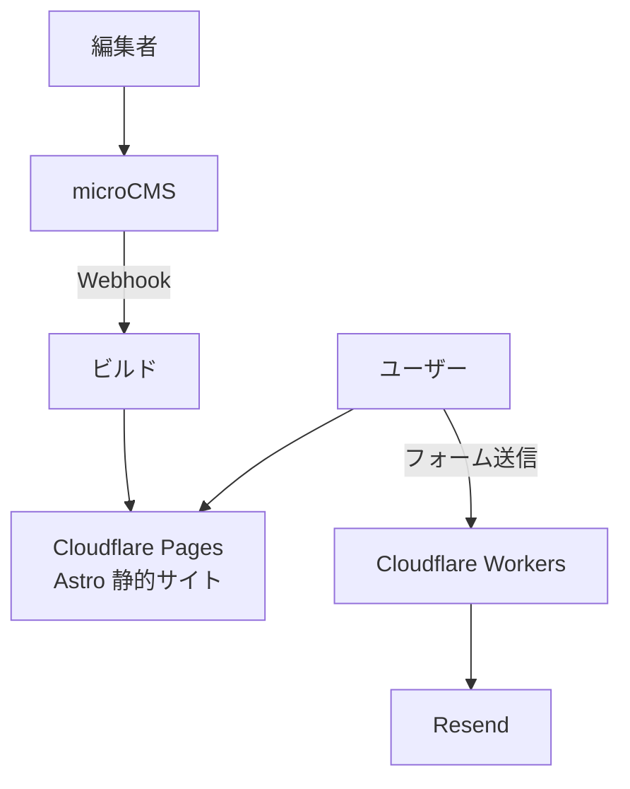

更新の即時反映は、CMSのWebhookからビルドを起動して行う。

### 19-2. EC（標準）

| レイヤー | 採用 |
|---|---|
| 本体 | Shopify（テーマはLiquid） |
| 決済 | Shopify Payments＋国内決済アプリ |
| 追加機能 | Shopifyアプリ。独自処理が必要ならShopify Functions |

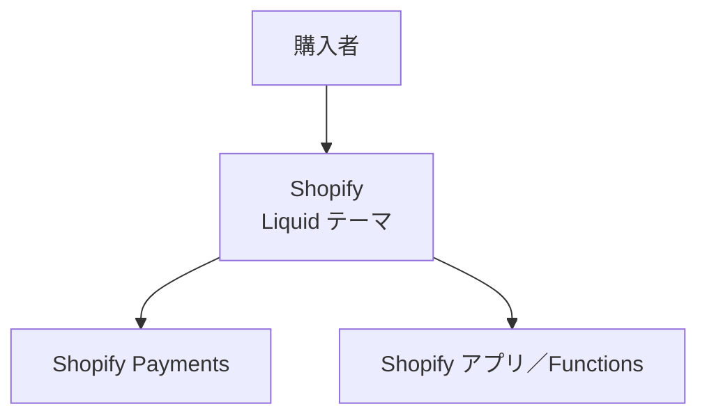

### 19-3. EC（独自要件が多い）

| レイヤー | 採用 |
|---|---|
| コマースエンジン | Medusa（TypeScript） |
| フロント | Next.js＋shadcn/ui |
| DB | RDS for PostgreSQL |
| 決済 | Stripe＋KOMOJU（国内決済手段） |
| 検索 | Meilisearch |
| 画像 | Cloudflare Images |
| メール | Amazon SES＋React Email |
| インフラ | ECS on Fargate、Cloudflare（CDN・WAF・Waiting Room） |
| 監視 | Sentry＋Grafana Cloud |

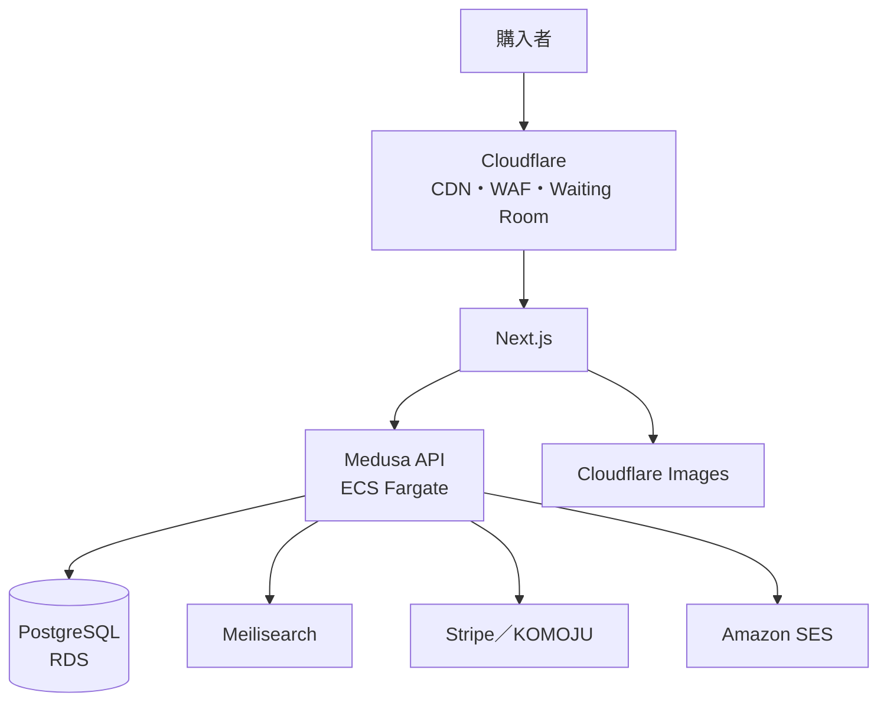

### 19-4. 業務システム・社内ツール（Rails構成）

| レイヤー | 採用 |
|---|---|
| アプリ | Rails 8＋Hotwire＋tailwindcss-rails＋ViewComponent |
| DB | PostgreSQL |
| ジョブ・キャッシュ | Solid Queue／Solid Cache |
| 認証 | Rails 8認証ジェネレータ（社内ならGoogle／Entra IDのSSO） |
| 認可 | Pundit |
| 管理画面 | Avo |
| 帳票 | Playwright（HTML→PDF） |
| デプロイ | Kamal（オンプレVM・VPS）またはRender |
| テスト | Minitest＋システムテスト |
| 静的解析 | RuboCop、Brakeman、bundler-audit |

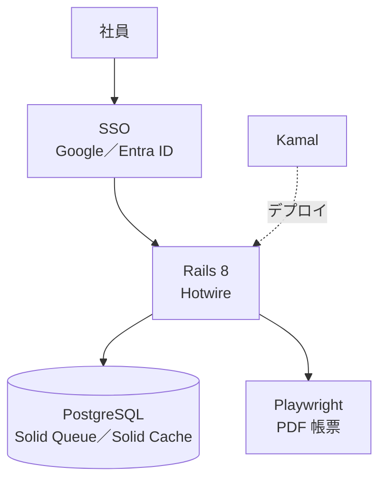

### 19-5. 業務システム・社内ツール（TypeScript構成）

| レイヤー | 採用 |
|---|---|
| フロント | React＋Vite＋TanStack Router＋TanStack Query |
| UI | shadcn/ui＋TanStack Table（編集が重いならAG Grid） |
| フォーム | React Hook Form＋Zod |
| API | Hono（RPCでフロントと型共有） |
| DB | PostgreSQL＋Drizzle |
| 認証 | Better Auth（社内ならSSO） |
| ジョブ | BullMQ＋Valkey（またはpg-boss） |
| リポジトリ | pnpm workspaces＋Turborepo（apps/web、apps/api、packages/shared） |
| デプロイ | ECS on Fargate、またはコンテナでオンプレVM |

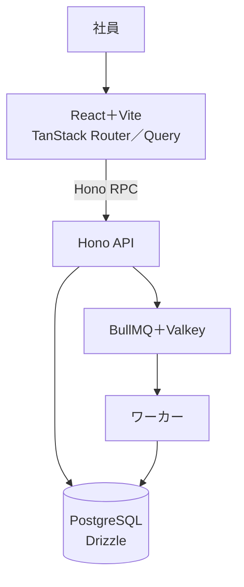

### 19-6. 自社SaaS（B2B）

| レイヤー | 採用 |
|---|---|
| フロント | Next.js＋shadcn/ui＋TanStack Query |
| バックエンド | Go（net/http＋sqlc＋pgx）。少人数ならHono |
| API | OpenAPI（oapi-codegen）→ openapi-typescriptでクライアント生成 |
| DB | PostgreSQL（テナントIDカラム＋Row Level Security） |
| ジョブ | River |
| 認証 | Clerk（SSO／SCIMが必要になったらWorkOS） |
| 課金 | Stripe Billing |
| 監査ログ | 専用テーブルに追記のみで記録 |
| インフラ | ECS on Fargate＋RDS＋Terraform |
| 分析・機能フラグ | PostHog |
| 監視 | Sentry＋OpenTelemetry＋Grafana Cloud |

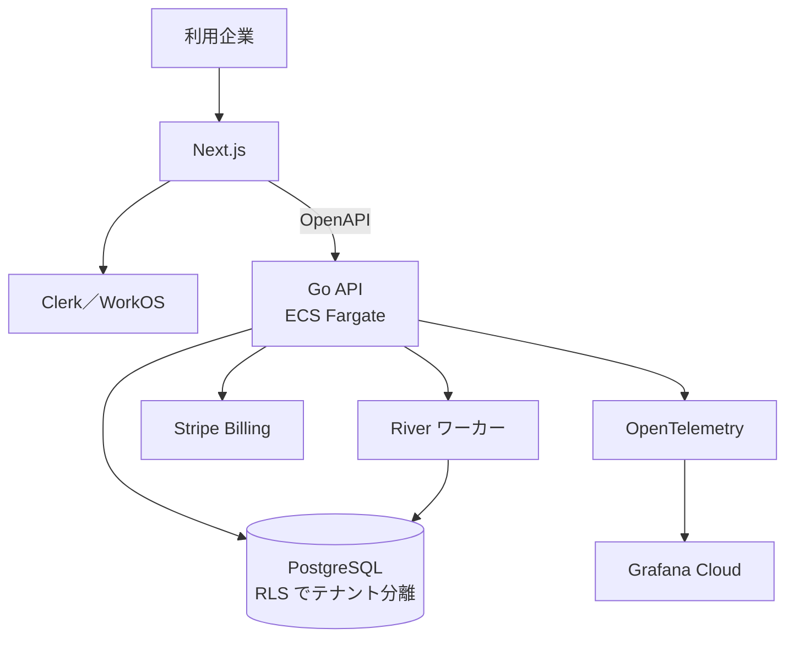

最初に決めること：マルチテナントの分離方式、SSO対応の時期、監査ログの範囲。

### 19-7. toCサービス（Web＋モバイル）

| レイヤー | 採用 |
|---|---|
| Web | Next.js |
| モバイル | React Native＋Expo（Expo Router、NativeWind） |
| バックエンド | Hono（またはGo） |
| DB・認証・ストレージ | Supabase（小〜中規模）／ RDS＋Clerk＋S3（中規模以上） |
| プッシュ通知 | FCM（Expo Notifications） |
| 画像・動画 | Cloudflare Images／Cloudflare Stream |
| 分析 | PostHog |
| 配信 | EAS Build／Submit／Update |

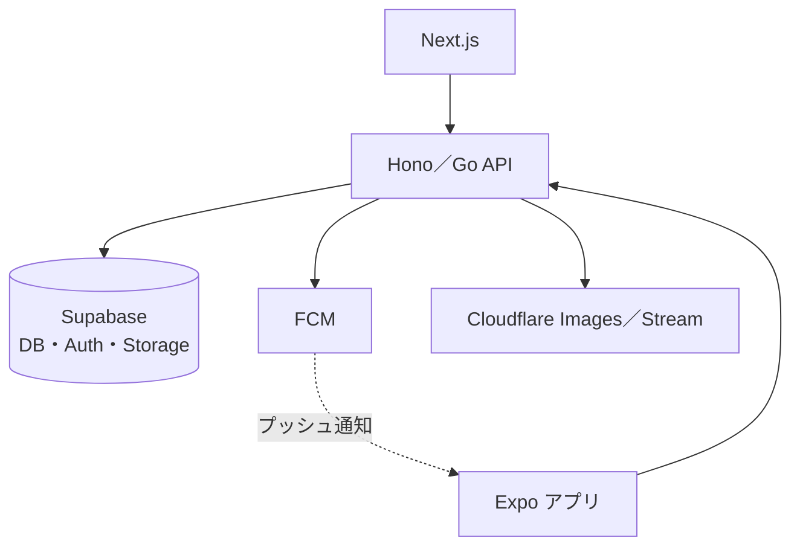

### 19-8. AI／LLMプロダクト

| レイヤー | 採用 |
|---|---|
| フロント | Next.js（ストリーミング表示） |
| AIバックエンド | LLM API呼び出し中心ならHono（TS）、埋め込み・ML処理があるならFastAPI（uv、Ruff、Pydantic） |
| DB・ベクトル | PostgreSQL＋pgvector |
| 長時間処理 | Temporal、またはInngest |
| 評価・トレース | Langfuse |
| 監視 | Sentry＋OpenTelemetry |

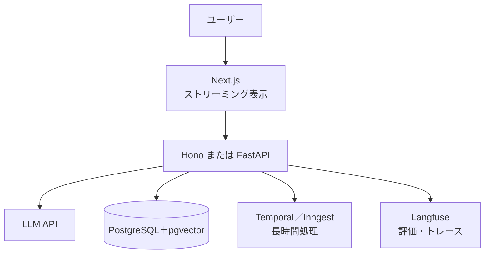

利用規約・データ取り扱い（学習への利用有無、保存リージョン）を利用者に説明できる状態にしておく。

### 19-9. リアルタイム系（チャット・通知・共同編集）

| 規模・構成 | 採用 |
|---|---|
| Rails | Action Cable＋Solid Cable |
| TS・マネージド | Cloudflare Durable Objects |
| 同時接続が非常に多い・プレゼンスが必要 | Elixir（Phoenix Channels＋Presence） |
| 同時接続が多い（Elixirを採用しない場合） | Go（WebSocket）＋Valkey Pub/Sub |
| 共同編集 | Yjs（マネージドならLiveblocks） |
| 片方向で足りる | Server-Sent Events |

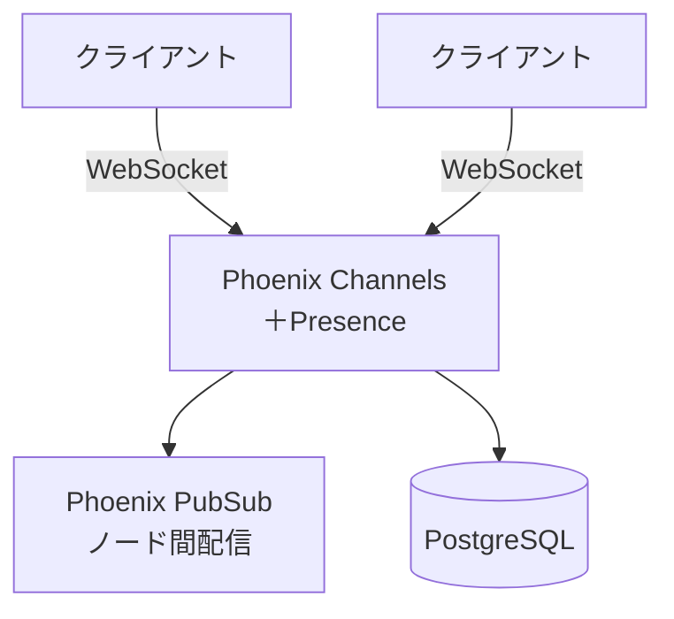

### 19-10. インフラツール・CLI

| レイヤー | 採用 |
|---|---|
| 言語 | Go（Cobra、slog） |
| 配布 | GoReleaser（GitHub Releases、Homebrew tap） |
| 性能が厳しい箇所 | Rust（clap、Tokio） |

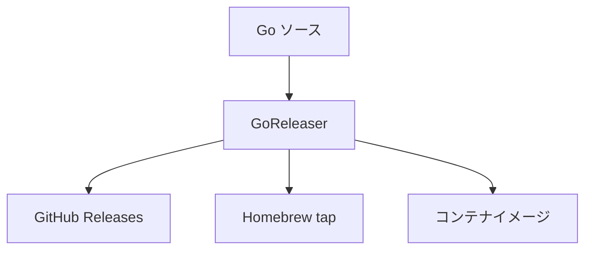

### 19-11. 個人開発・MVP

| パターン | 構成 |
|---|---|
| TS全部入り | Next.js＋Supabase＋Vercel |
| エッジ | Hono＋Cloudflare Workers＋D1／R2 |
| Railsワンマン | Rails 8＋SQLite＋Kamal＋VPS |
| Go単体 | Go＋PostgreSQL＋htmx |

PaaSは必ず支出上限を設定する。

### 19-12. 高トラフィック（セール・チケット販売）

| 対策 | 採用 |
|---|---|
| 入場制御 | Cloudflare Waiting Room |
| 読み取り | 静的生成＋CDNキャッシュ |
| 在庫・注文 | SQSで直列化、在庫は行ロックまたは条件付きUPDATE |
| DB | RDS Proxy＋リードレプリカ |
| 事前検証 | k6で本番相当の負荷試験 |

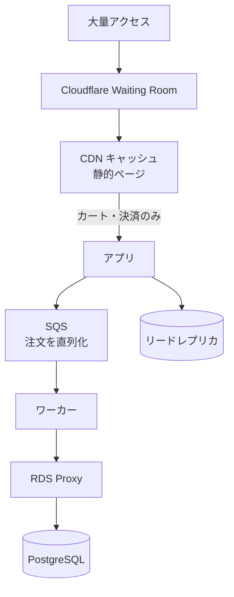

動的処理は「カート投入」と「決済」に絞り、それ以外はキャッシュから返す。

---

## 20. 採用しないもの（理由付き）

| 対象 | 理由 | 代わりに使うもの |
|---|---|---|
| PHP全般（Laravel、WordPress、EC-CUBE等） | 本ガイドの前提 | §19の各構成 |
| GORM（Go） | 暗黙の挙動が多く、性能問題の追跡が困難 | sqlc |
| Create React App | 開発終了 | Vite |
| MailHog | 開発停止 | Mailpit |
| Moment.js | メンテナンスモード | date-fns |
| ESLintとBiomeの併用 | 役割の重複 | どちらか一方（既定はBiome） |
| Kubernetes（小〜中規模） | 運用負荷に見合わない | ECS on Fargate、Cloud Run、Kamal |
| アクセスキーを使ったCIのAWS認証 | 漏洩リスク | OIDC |
| 自前のパスワード認証を一から実装 | セキュリティリスク | §6の既定 |

---

## 21. 案件開始時のチェックリスト

- [ ] 保守の担い手を確認した
- [ ] 実行環境（AWS／PaaS／オンプレ要件）を確認した
- [ ] 非エンジニアによる更新の有無を確認した
- [ ] 必要な決済手段（コンビニ払い、後払い等）を確認した
- [ ] 帳票・PDF出力の有無を確認した
- [ ] SSO・監査ログの要否を確認した
- [ ] ピークトラフィックの想定を確認した
- [ ] SaaS費用の契約名義を決めた
- [ ] §19からケースを選び、差分があればADRに記録した
- [ ] リポジトリに §1 の共通ファイルを配置した
- [ ] CIに §13 の最低限のチェックを入れた
- [ ] Sentry・外形監視を本番公開前に設定した

---

## 22. 採用の根拠

### 22-1. 全体方針の根拠

| 方針 | 根拠 |
|---|---|
| 既定の言語は少数（TypeScript・Go・Ruby）に絞り、それ以外（Rust、Kotlin、Elixir、C#、Python）は条件を満たしたときだけ使う（§2-9、§2-10） | 知識とコード資産を案件間で再利用でき、レビューの質も上がる。一方で、既定で無理をせず、負荷や制約に合った言語を明文化した条件で選べる |
| 標準規格を優先する（SQL／PostgreSQL、OpenAPI、OpenTelemetry、OCIコンテナ） | 特定ベンダーに閉じ込められない。クラウドや監視サービスを後から乗り換えられる |
| マネージドサービスを優先する | OSやミドルウェアのパッチ適用、冗長化、バックアップを提供者に任せられる。運用の人件費と事故リスクを下げられる |
| インフラをコード化し、CIで検査する | 環境をいつでも再現でき、変更履歴がレビューを経て残る。属人化しない |
| 設計判断をADRで記録する | 「なぜこうなっているか」が後から追える。引き継ぎ資料を別途作る必要がない |

### 22-2. 主要技術ごとの根拠

| 技術 | 採用の根拠 | よくある懸念と回答 |
|---|---|---|
| TypeScript | GitHubのOctoverse 2025で、2025年8月に月間コントリビューター数でPythonとJavaScriptを抜き最も使われる言語になった。Next.jsやAstroなど主要フレームワークが既定でTypeScriptのプロジェクトを生成する。型によって多くの不具合をリリース前に検出でき、AIによるコード生成の誤りも型チェックで拾いやすい。フロントとバックエンドを1言語で書ける | 「JavaScriptより難しいのでは」→ 型は段階的に導入でき、エディタ補完が効くぶん学習もしやすい |
| Go | 単一バイナリで配布でき、実行時の依存がない。メモリ使用量が小さく、同時接続に強い。Go 1互換性の約束により、長期間コードが壊れにくい。Docker、Kubernetes、TerraformなどインフラOSSの多くがGoで書かれている | 「人材が少ないのでは」→ 言語仕様が小さく、他言語経験者なら短期間で読み書きできる |
| Rails 8 | CRUD中心のアプリで開発速度が非常に高い。Rails 8はジョブ・キャッシュ・WebSocketをDBだけで動かせるため、Redisなどの追加ミドルウェアが不要。GitHubやShopifyが大規模に運用している実績がある。Kamalで特定のPaaSに依存せずデプロイできる | 「Rubyは下火では」→ 採用企業は安定して存在し、フレームワークは毎年活発に更新されている |
| PostgreSQL | OSSでライセンス費用がかからない。AWS、GCP、Azureを含む主要クラウドがすべてマネージド版を提供している。拡張機能（pgvector、pg_bigm）でベクトル検索や日本語全文検索までこなせるため、専用DBを増やさずに済む | 「MySQLの方が一般的では」→ 機能・標準SQLへの準拠・拡張性で優位。移行ツールも揃っている |
| Rust | GCがなく、C/C++並みの性能とメモリ効率を出しながら、メモリ安全性をコンパイル時に保証できる。WebAssemblyやネイティブ拡張として他の環境に組み込みやすい。近年の高速な開発ツール（Biome、Ruff、uvなど）の多くがRust製で、実用性が証明されている | 「開発が遅くなるのでは」→ 性能・安全性が効く箇所に限定して使い、その他はGo・TypeScriptで書く（§2-10） |
| Kotlin | JVMの成熟したトランザクション・バッチ・ストリーム処理の基盤をそのまま使え、Javaより簡潔で安全に書ける。既存のJava資産と直接連携できる | 「重いのでは」→ 起動時間が問題になる用途（サーバーレス）以外では、常駐サーバーとして十分な性能が出る |
| Elixir | 軽量プロセスと監督ツリーにより、大量の常時接続と障害時の自動復旧を少ないコードで実現できる。Discordなどが大規模なリアルタイム基盤で採用している | 「人材が少ない」→ 採用は常時接続が中核のサービスに限る。書ける人材の確保を採用の前提条件にする |
| C# | Unityとサーバーでコードを共有でき、ASP.NET Coreは性能も高い。Microsoft環境との親和性が高い | 「Windows専用では」→ .NETはLinux・コンテナで普通に動く |
| Python（AI用途のみ） | 機械学習・LLM関連のライブラリがPythonに集中しており、代替が事実上ない | 「なぜ全部Pythonにしないのか」→ Webアプリ本体はTypeScript・Go・Railsの方が型安全性や開発効率で有利 |
| コンテナ＋Terraform | 開発・検証・本番で同じイメージを使えるため、環境差による不具合が起きにくい。クラウド移行時もコードから再構築できる | 「学習コストが高い」→ テンプレート化しており、案件ごとの差分は小さい |
| Cloudflare | DNS、CDN、WAF、DDoS対策、アクセス集中時の入場制御（Waiting Room）を1か所で管理できる | 「障害時に全部止まるのでは」→ オリジンへの直接経路と切り戻し手順をランブックに用意する |
| Stripe／KOMOJU | カード情報を自社システムで扱わずに済み、PCI DSSの対応範囲を最小にできる。国内の決済手段（コンビニ払い等）はKOMOJUで補える | 「手数料が高い」→ 自前でカード情報を扱う場合のセキュリティ対策・監査コストと比べて判断する |
| マネージド認証（Clerk、Cognito等） | 認証はセキュリティ事故の影響が最も大きい領域。パスキーや多要素認証を自前実装せずに済む | 「ロックインでは」→ 標準のOIDCで連携するため、IdPの差し替えは可能 |
| Sentry＋OpenTelemetry | 障害の検知と原因特定の時間を短縮できる。計装をOpenTelemetryにしておけば、監視サービスを後から変更できる | 「費用がかかる」→ 無料枠・サンプリングで調整できる。障害の長期化による損失の方が大きい |

### 22-3. PHPを採用しない理由

- **品質に責任を持てる範囲に集中するため**：深い知見があり、品質を保証できる言語に絞っている。これが最大の理由であり、PHPという言語の優劣の問題ではない。
- **言語を統一できない**：フロントエンドは必ずTypeScriptになるため、バックエンドにPHPを入れると2言語の保守が必要になる。
- **エコシステムのばらつき**：PHP 8系で型や性能は大きく改善したが、周辺ライブラリやプラグインでは型の整備が不均一な資産がまだ多い。
- **セキュリティ運用の負担**：WordPressなどのCMSでは、脆弱性の多くがサードパーティのプラグインに起因しており、継続的な更新と監視が欠かせない。ヘッドレスCMS＋静的配信ならこの負担をほぼなくせる。

公平のため付記すると、PHPは人材の母数と安価なホスティングという点では依然として強い。その利点を捨ててでも、上記の理由で集中を選ぶという判断である。

### 22-4. よくある疑問と回答

| 質問 | 回答 |
|---|---|
| 将来、保守を他の人に引き継げなくなるのでは？ | TypeScriptとGoは利用者が多く、担い手は増え続けている。README、ADR、IaC、CIを整備しているため、第三者でも環境を再現して引き継げる。独自技術は使っていない |
| 月額費用が高くならないか？ | マネージドサービスは月額が見える一方、サーバー保守・パッチ適用・障害対応の人件費が減る。総額で比較する。コンテンツ中心のサイトは静的配信にすることで、むしろ安くなることが多い。PaaSには支出上限を設定する |
| WordPressなら非エンジニアでも更新できるのに？ | ヘッドレスCMS（microCMSなど）で同等以上の更新体験を用意できる。プラグインの更新作業や改ざん対応が不要になる |
| 実績のある技術なのか？ | RailsはGitHubやShopify、GoはDockerやKubernetesなど、大規模な利用実績がある。PostgreSQLは主要クラウドすべてが公式に提供している |
| クラウドやSaaSの障害時はどうなるのか？ | 冗長構成、外形監視、障害対応手順（ランブック）を用意する。1つのサービスが止まっても全体が止まらないよう、依存先は §20 と §22 の基準で選んでいる |
| 使っている技術が数年後に廃れないか？ | 利用者の多さと標準規格への準拠を選定基準にしている。本ガイドは定期的に見直し、廃れた技術は §20「採用しないもの」に移して置き換える |

---

## 23. 判断の目安となる数値

いずれも一般的な構成・適切なインデックス設計を前提にした**目安**であり、保証値ではない。境界付近では必ず負荷試験（k6）で確認する。

### 23-1. データベース

| 項目 | まず単体で足りる範囲（目安） | 次の手を打つきっかけ | 次の手 |
|---|---|---|---|
| PostgreSQL単体 | データ量が数百GB〜1TB程度、書き込みが秒間数千件程度まで | 読み取りのCPU使用率が継続して高い（70%超が続く） | リードレプリカ → キャッシュ → テーブル分割（パーティション） |
| コネクション数 | アプリのインスタンス数×プール数が数百程度まで | 接続数の上限に近づく、サーバーレスから接続する | RDS Proxy／PgBouncer |
| 日本語全文検索（pg_bigm） | 数百万件程度、応答が100ms前後に収まる範囲 | 表記揺れ吸収・ファセット・サジェストが必要、応答が遅くなる | Meilisearch |
| ベクトル検索（pgvector＋HNSW） | 数百万ベクトル程度 | 数千万件以上、または複雑な条件付き検索の性能が出ない | Qdrant |
| Postgresベースのジョブキュー | 秒間数百件程度 | 秒間数千件以上、またはDB負荷の大半をキューが占める | SQS、Valkey（BullMQ／Sidekiq） |
| SQLite（単一サーバー） | 書き込みの同時実行が少なく、サーバー1台で足りる範囲 | 複数台構成にしたい、書き込み待ちが目立つ | PostgreSQL |

### 23-2. 実行環境

| 項目 | 目安 | 判断 |
|---|---|---|
| Lambda と 常駐コンテナ | リクエストが一日中途切れず続くなら、常駐コンテナの方が安くなりやすい | まばらなリクエスト・イベント処理はLambda、常時トラフィックはECS／Cloud Run |
| Lambdaの実行時間 | 1回あたり最大15分 | 超える可能性がある処理はECSタスクかStep Functionsで分割 |
| コールドスタート | TypeScript・Pythonは短め、Goは非常に短い、JVMは長い | 起動時間が体感に効く同期APIでは、JVMのLambdaを避ける |
| PaaS（Vercel等）からの移行 | 月額費用が、自前コンテナ運用にかかる人件費を上回り始めたら | §24 の移行パスに従う |
| Kubernetes | 常時稼働するサービスが10前後以上あり、専任の運用担当がいる | それ未満ならECS／Cloud Run／Kamal |
| マルチリージョン | 目標復旧時間が分単位で、リージョン全体の障害を許容できない | それ以外はマルチAZで十分 |

### 23-3. 同時接続・レイテンシ

| 項目 | 目安 | 判断 |
|---|---|---|
| WebSocket同時接続（Node.js） | 1プロセスあたり数千〜1万程度 | 超えるならプロセスを増やしてPub/Subで連携、またはGo／Elixir |
| WebSocket同時接続（Go） | 1台あたり数万〜10万程度 | — |
| WebSocket同時接続（Elixir／Phoenix） | 1台あたり数十万以上 | プレゼンスや配信が中核ならElixir |
| p99レイテンシ 100ms程度 | どの言語でも達成できる | 言語選定の理由にならない。DBとキャッシュを見直す |
| p99レイテンシ 10ms未満が厳格に必要 | GCのある言語では上振れの管理が難しくなる | Rustを検討（§2-10） |

### 23-4. チーム・構成

| 項目 | 目安 | 判断 |
|---|---|---|
| 開発者1〜2人 | 言語を1つに絞る | フロントと同じTypeScript、またはRails単体 |
| 開発者10人以上 | モジュール構造を強制する仕組みが必要 | NestJS、Kotlin（Spring）、Goならパッケージ境界のルール化 |
| モノリスの分割 | チーム間でデプロイ待ちが常態化した、または特定機能だけ独立してスケールさせる必要が明確になった | それまではモノリスのまま、モジュール境界だけ明確にしておく |
| 言語を1つ追加する | 既定の言語では要件を満たせない、または明らかに大きな差がつく | §2-10 の混在ルールに従う |

---

## 24. 成長したときの移行パス

最初は安く速い構成で始め、きっかけが来たら次へ移る。移行を楽にするために、**最初からやっておく備え**を守る。

| 始めの構成 | 移行先 | 移行のきっかけ | 最初からやっておく備え |
|---|---|---|---|
| Supabase（DB・認証・ストレージ一体） | RDS＋Clerk等＋S3 | 費用の増加、細かいチューニングや閉域接続が必要 | 標準的なPostgres機能だけを使う。ユーザーIDは自前のテーブルでも保持する |
| Neon | RDS／Aurora | 常時高負荷になり、従量課金より固定費が安くなった | 接続文字列を環境変数で切り替えられるようにする |
| SQLite（Rails単一サーバー） | PostgreSQL | 複数台構成にしたい、書き込み待ちが目立つ | SQLite固有の書き方を避け、ActiveRecordの範囲で書く |
| Vercel（Next.js） | ECS／Cloud Run（コンテナ） | 費用の増加、AWSに集約したい | Next.jsのstandalone出力でコンテナ化できる状態を保つ。Vercel固有の機能への依存を最小にする |
| Render／Fly.io | AWS（ECS＋RDS＋Terraform） | 閉域網・監査・細かい権限管理が必要になった | Dockerfileでビルドし、設定はすべて環境変数から読む |
| Kamal（単一サーバー） | 複数台／ECS | 1台で処理しきれない、冗長化が必要 | アプリをステートレスにする。セッションとファイルはDB・S3に置く |
| Postgres全文検索（pg_bigm） | Meilisearch | §23-1 の目安を超えた | 検索処理を1か所（リポジトリ層）にまとめ、呼び出し側から検索エンジンを隠す |
| pgvector | Qdrant | §23-1 の目安を超えた | ベクトル検索を専用のインターフェース経由で呼ぶ |
| Postgresベースのジョブキュー | SQS／Valkey | §23-1 の目安を超えた | ジョブの投入と処理をインターフェースで抽象化する |
| Clerk | 他のIdP・自前認証 | 費用の増加、要件がClerkの範囲を超えた | OIDCの標準仕様で連携する。ユーザー情報の正本は自前のDBに持つ |
| モノリス | サービス分割 | §23-4 の目安に当たった | 機能ごとにディレクトリ・パッケージを分け、モジュール間の呼び出しを限定する |
| TypeScriptのバックエンド | 一部をGo／Rustに切り出し | CPU負荷・レイテンシがボトルネックになった | APIをOpenAPIで定義しておき、実装言語を差し替えられるようにする |
| Shopify | Medusa（独自コマース） | Shopifyで実現できない要件が増えた | 商品・顧客データを定期的にエクスポートできる状態にしておく |
| CloudWatchのみ | Grafana Cloud／Datadog | サービスが増え、横断的に調査したくなった | 最初からOpenTelemetryで計装する |
| 手作業のインフラ構築 | Terraform管理 | —（最初からTerraformにする） | 検証環境であってもコンソールでの手作業を避ける |

---

## 25. 費用の考え方

料金は頻繁に変わるため、金額は記載しない。採用前に各サービスの料金ページで最新の金額を確認する。ここでは**何に対して課金され、どこで膨らみやすいか**を整理する。

| サービス | 主な課金の軸 | 膨らみやすい要因 | 対策 |
|---|---|---|---|
| Vercel | 関数の実行、データ転送、ビルド | 画像最適化・SSRの多用、アクセス急増 | 支出上限を設定する。静的生成できるページは静的にする |
| Supabase／Neon | コンピュート時間、ストレージ | 常時起動の設定、使っていないブランチやプロジェクトの放置 | 自動停止を有効にする。不要なブランチを削除する |
| Amazon RDS | インスタンスの稼働時間、ストレージ、I/O、バックアップ | 過大なインスタンスサイズ、使っていない検証環境の常時稼働 | 検証環境は夜間停止する。リザーブドインスタンスを検討する |
| ECS Fargate | vCPU・メモリの稼働時間 | 過大なタスクサイズ、最小タスク数の設定しすぎ | 実測に合わせて調整する。検証環境はSpotを使う |
| AWS Lambda | リクエスト数、実行時間×メモリ | 常時トラフィックをLambdaで処理している | §23-2 の目安で常駐コンテナへ移す |
| NAT Gateway | 稼働時間、処理したデータ量 | プライベートサブネットからの外部通信量（イメージ取得、外部API） | VPCエンドポイントを使う。検証環境では構成を見直す |
| S3 | 保存量、リクエスト数、データ転送 | 外部への大量配信 | CloudFront経由で配信する。配信が多いならR2を検討する |
| Cloudflare R2 | 保存量、操作回数（外部への転送は無料） | 大量の小さなファイル操作 | まとめて扱う |
| Datadog | ホスト数、ログ量、カスタムメトリクス | ログの全量送信、タグの組み合わせ爆発 | 送信するログを絞る。サンプリングを使う |
| Sentry | エラー・トランザクションのイベント数 | 同じエラーの大量発生、トレースの全量送信 | サンプリング率を設定する。既知のノイズを除外する |
| Clerk／Auth0 | 月間アクティブユーザー数 | toCでユーザーが急増 | 規模が見えたら §24 の移行パスを検討する |
| Algolia | 検索リクエスト数、レコード数 | 入力のたびに検索する実装 | デバウンスを入れる。規模次第でMeilisearchを検討する |
| LLM API | 入出力のトークン数 | 長いプロンプトの繰り返し送信、不要な再生成 | プロンプトキャッシュを使う。用途ごとに小さいモデルを使い分ける |
| Stripe／KOMOJU | 決済額に対する手数料率 | — | 決済手段ごとの料率を事前に確認する |

**共通の対策**：クラウドの予算アラートを必ず設定する。PaaSは支出上限を設定する。検証環境は使わない時間に停止する。

---

## 26. 作り始めのコマンド集

§19 の各構成の雛形を作るコマンド。対話式のものは質問に答えて進める。先に共通の準備を済ませておく。

### 26-1. 共通の準備

```bash
# 言語・ツールのバージョン固定（使う言語だけ）
mise use node@lts pnpm@latest
mise use go@latest
mise use ruby@latest
mise use python@latest uv@latest

# Gitフックと依存更新
pnpm add -D lefthook && pnpm exec lefthook install
# renovate.json を置き、GitHubでRenovateアプリを有効化する
```

### 26-2. コーポレートサイト（§19-1）

```bash
pnpm create astro@latest
pnpm astro add tailwind
# Cloudflare Pages にリポジトリを接続してデプロイ
```

### 26-3. EC・独自要件（§19-3）

```bash
npx create-medusa-app@latest
pnpm create next-app@latest storefront
```

### 26-4. 業務システム・Rails構成（§19-4）

```bash
gem install rails
rails new app -d postgresql -c tailwind
cd app
bin/rails generate authentication
bundle add pundit pagy
# Kamalの設定は config/deploy.yml に生成済み
```

### 26-5. 業務システム・TypeScript構成（§19-5）

```bash
pnpm dlx create-turbo@latest app
cd app/apps
pnpm create vite@latest web --template react-ts
pnpm create hono@latest api
# api側
pnpm add drizzle-orm pg better-auth zod
pnpm add -D drizzle-kit @types/pg
# web側
pnpm dlx shadcn@latest init
pnpm add @tanstack/react-query @tanstack/react-router react-hook-form
# 共通
pnpm add -D -E @biomejs/biome && pnpm exec biome init
pnpm add -D vitest && pnpm create playwright
```

### 26-6. 自社SaaS・Goバックエンド（§19-6）

```bash
mkdir api && cd api
go mod init example.com/app/api
go install github.com/sqlc-dev/sqlc/cmd/sqlc@latest
go install github.com/pressly/goose/v3/cmd/goose@latest
go install github.com/oapi-codegen/oapi-codegen/v2/cmd/oapi-codegen@latest
go get github.com/jackc/pgx/v5 github.com/riverqueue/river
sqlc init
goose -dir db/migrations create init sql
```

### 26-7. toCサービス（§19-7）

```bash
npx create-expo-app@latest mobile
pnpm create next-app@latest web
npx supabase init
```

### 26-8. AI／LLMプロダクト（§19-8）

```bash
# Python（ML系の処理がある場合）
uv init ai-api && cd ai-api
uv add "fastapi[standard]" sqlalchemy alembic pgvector httpx
uv add --dev ruff pytest pyright
```

### 26-9. リアルタイム・Elixir（§19-9）

```bash
mix archive.install hex phx_new
mix phx.new app
cd app && mix ecto.create
```

### 26-10. CLI（§19-10）

```bash
go mod init example.com/tool
go get github.com/spf13/cobra
goreleaser init
```

### 26-11. その他の言語

```bash
# Rust（Web API）
cargo new app && cd app
cargo add axum serde --features serde/derive
cargo add tokio --features full
cargo add sqlx --features runtime-tokio,postgres
# Rust（デスクトップ）
pnpm create tauri-app@latest
# Kotlin（Spring Boot）
curl https://start.spring.io/starter.zip \
  -d language=kotlin -d type=gradle-project-kotlin \
  -d dependencies=web,jooq,flyway,postgresql,actuator \
  -o app.zip
# C#（ASP.NET Core）
dotnet new webapi -n App
```

### 26-12. インフラ

```bash
mise use terraform@latest   # または opentofu
terraform init
# Cloudflare Workers
pnpm create cloudflare@latest
```

---

## 27. 習熟度表

主要ツールについてチームの習熟度を記録する。未経験のツールを採用する場合は、検証期間を見積もりに含める。HTML版ではその場で選択でき、ブラウザに保存される（JSONで書き出し・読み込みも可能）。

| ツール | 区分 | 習熟度 |
|---|---|---|
| TypeScript | 言語 |  |
| Go | 言語 |  |
| Ruby / Rails | 言語・フレームワーク |  |
| Python | 言語 |  |
| Rust | 言語 |  |
| Kotlin | 言語 |  |
| Elixir / Phoenix | 言語・フレームワーク |  |
| C# / .NET | 言語・フレームワーク |  |
| Next.js | フロントエンド |  |
| Astro | フロントエンド |  |
| React Native / Expo | モバイル |  |
| Hono | バックエンド |  |
| Drizzle | データアクセス |  |
| sqlc | データアクセス |  |
| PostgreSQL | データベース |  |
| Valkey / Redis | データベース |  |
| Meilisearch | 検索 |  |
| Better Auth | 認証 |  |
| Clerk | 認証 |  |
| Stripe | 決済 |  |
| KOMOJU | 決済 |  |
| microCMS | CMS |  |
| Medusa | EC |  |
| Shopify | EC |  |
| Docker | インフラ |  |
| Terraform | インフラ |  |
| ECS / Fargate | インフラ |  |
| Kamal | インフラ |  |
| Cloudflare | インフラ |  |
| GitHub Actions | CI/CD |  |
| Sentry | 監視 |  |
| OpenTelemetry | 監視 |  |
| Grafana | 監視 |  |
| Temporal | ワークフロー |  |
| PostHog | 分析 |  |

習熟度の区分：**未経験**（触ったことがない）／**検証済み**（試作・学習で使った）／**実務**（本番で運用した）

---

## 追記欄（案件ごとの実績・所感）

| 案件 | ケース | 採用スタック | 既定からの差分と理由 | 結果・所感 |
|---|---|---|---|---|
|  |  |  |  |  |
