## 19. ケース別の構成

確認：2026年9月

分野ごとの既定から、ケースごとに組み合わせたもの。記載のないレイヤーは各セクションの既定を使う。

### 19-1. コーポレートサイト・LP・メディア

```stack
head: [レイヤー, 採用]
rows:
  - layer: フロント
    pick: Astro＋Tailwind CSS
    tools: [astro, tailwind-css]
  - layer: CMS
    pick: microCMS（セルフホストならPayload）
    tools: [microcms, payload]
  - layer: ホスティング
    pick: Cloudflare Pages
    tools: [cloudflare-pages]
  - layer: フォーム
    pick: Cloudflare Workers＋Resend、スパム対策にCloudflare Turnstile
    tools: [cloudflare-workers, resend, cloudflare-turnstile]
  - layer: 検索
    pick: Pagefind
    tools: [pagefind]
  - layer: 分析
    pick: Cloudflare Web Analytics（取引先やマーケティング担当がGA4を求めるならGA4）
    tools: [cloudflare-web-analytics, ga4]
  - layer: 監視
    pick: Better Stack（外形監視）
    tools: [better-stack]
```

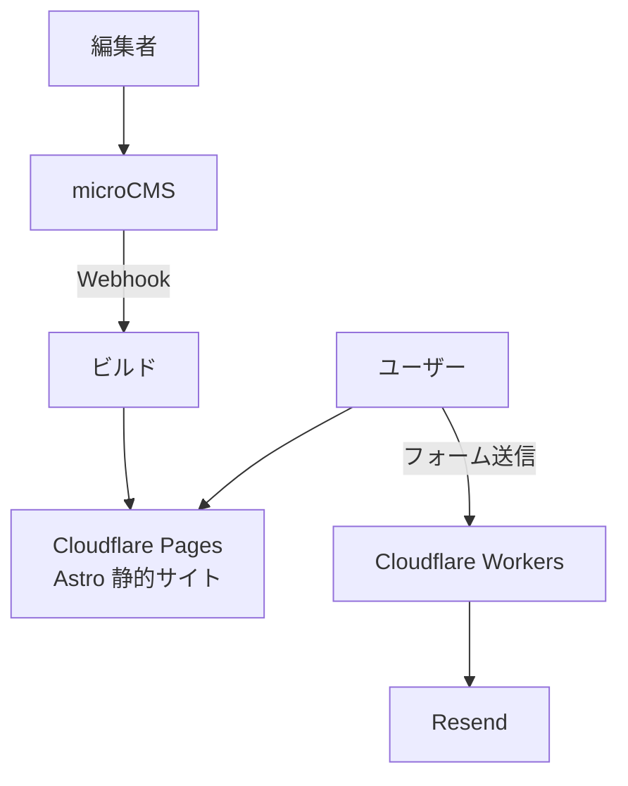

更新の即時反映は、CMSのWebhookからビルドを起動して行う。

### 19-2. EC（標準）

```stack
head: [レイヤー, 採用]
rows:
  - layer: 本体
    pick: Shopify（テーマはLiquid）
    tools: [shopify, liquid]
  - layer: 決済
    pick: Shopify Payments＋国内決済アプリ
    tools: [shopify-payments]
  - layer: 追加機能
    pick: Shopifyアプリ。独自処理が必要ならShopify Functions
    tools: [shopify, shopify-functions]
```

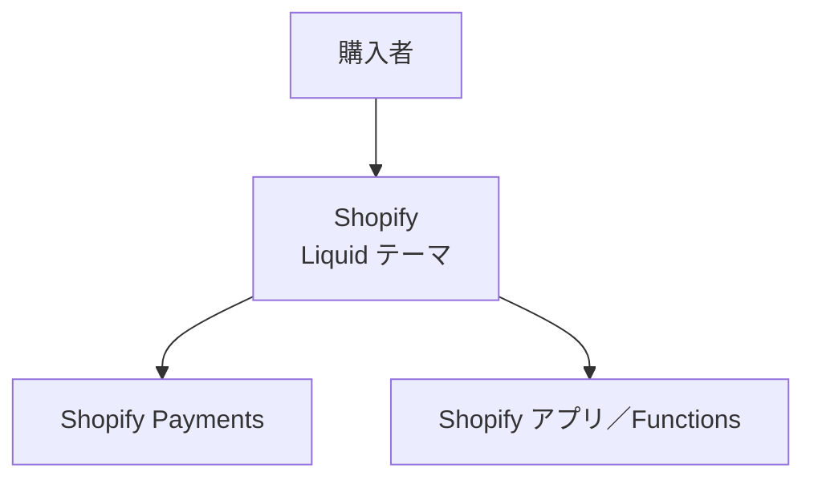

### 19-3. EC（独自要件が多い）

```stack
head: [レイヤー, 採用]
rows:
  - layer: コマースエンジン
    pick: Medusa（TypeScript）
    tools: [medusa, typescript]
  - layer: フロント
    pick: Next.js＋shadcn/ui
    tools: [next-js, shadcn-ui]
  - layer: DB
    pick: RDS for PostgreSQL
    tools: [rds]
  - layer: 決済
    pick: Stripe＋KOMOJU（国内決済手段）
    tools: [stripe, komoju]
  - layer: 検索
    pick: Meilisearch
    tools: [meilisearch]
  - layer: 画像
    pick: Cloudflare Images
    tools: [cloudflare-images]
  - layer: メール
    pick: Amazon SES＋React Email
    tools: [amazon-ses, react-email]
  - layer: インフラ
    pick: ECS on Fargate、Cloudflare（CDN・WAF・Waiting Room）
    tools: [ecs-on-fargate, cloudflare, cloudflare-waiting-room]
  - layer: 監視
    pick: Sentry＋Grafana Cloud
    tools: [sentry, grafana-cloud]
```

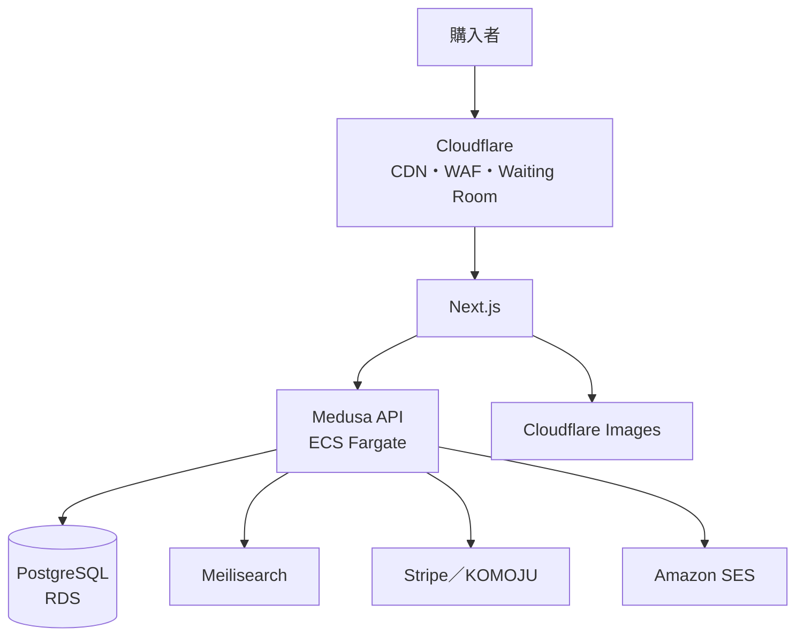

### 19-4. 業務システム・社内ツール（Rails構成）

```stack
head: [レイヤー, 採用]
rows:
  - layer: アプリ
    pick: Rails＋Hotwire＋tailwindcss-rails＋ViewComponent
    tools: [rails, hotwire, tailwindcss-rails, viewcomponent]
  - layer: DB
    pick: PostgreSQL
    tools: [postgresql]
  - layer: ジョブ・キャッシュ
    pick: Solid Queue／Solid Cache
    tools: [solid-queue, solid-cache]
  - layer: 認証
    pick: Railsの認証ジェネレータ（社内ならGoogle／Entra IDのSSO）
    tools: [rails, google-workspace, microsoft-entra-id]
  - layer: 認可
    pick: Pundit
    tools: [pundit]
  - layer: 管理画面
    pick: Avo
    tools: [avo]
  - layer: 帳票
    pick: Playwright（HTML→PDF）
    tools: [playwright]
  - layer: デプロイ
    pick: Kamal（オンプレVM・VPS）またはRender
    tools: [kamal, render]
  - layer: テスト
    pick: Minitest＋システムテスト
    tools: [minitest]
  - layer: 静的解析
    pick: RuboCop、Brakeman、bundler-audit
    tools: [rubocop, brakeman, bundler-audit]
```

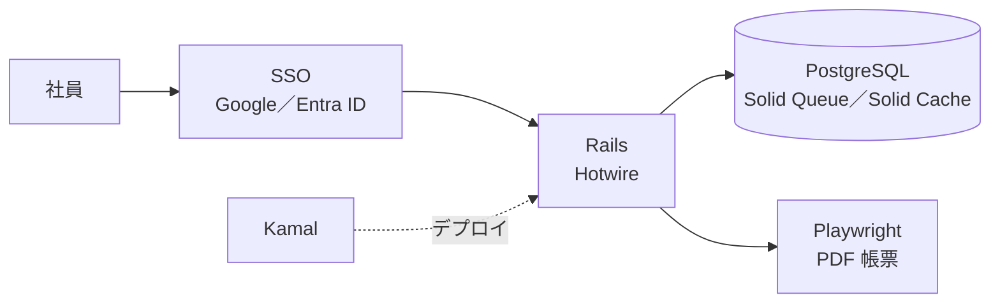

### 19-5. 業務システム・社内ツール（TypeScript構成）

```stack
head: [レイヤー, 採用]
rows:
  - layer: フロント
    pick: React＋Vite＋TanStack Router＋TanStack Query
    tools: [react, vite, tanstack-router, tanstack-query]
  - layer: UI
    pick: shadcn/ui＋TanStack Table（編集が重いならAG Grid）
    tools: [shadcn-ui, tanstack-table, ag-grid]
  - layer: フォーム
    pick: React Hook Form＋Zod
    tools: [react-hook-form, zod]
  - layer: API
    pick: Hono（RPCでフロントと型共有）
    tools: [hono]
  - layer: DB
    pick: PostgreSQL＋Drizzle
    tools: [postgresql, drizzle]
  - layer: 認証
    pick: Better Auth（社内ならSSO）
    tools: [better-auth]
  - layer: ジョブ
    pick: BullMQ＋Valkey（またはpg-boss）
    tools: [bullmq, valkey, pg-boss]
  - layer: リポジトリ
    pick: pnpm workspaces＋Turborepo（apps/web、apps/api、packages/shared）
    tools: [pnpm-workspaces, turborepo]
  - layer: デプロイ
    pick: Render（AWSならECS on Fargate、オンプレならコンテナでVM）
    tools: [render, ecs-on-fargate]
```

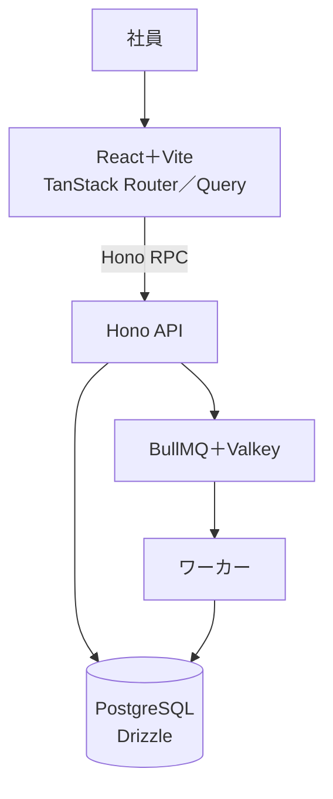

### 19-6. 自社SaaS（B2B）

```stack
head: [レイヤー, 採用]
rows:
  - layer: フロント
    pick: Next.js＋shadcn/ui＋TanStack Query
    tools: [next-js, shadcn-ui, tanstack-query]
  - layer: バックエンド
    pick: Go（net/http＋sqlc＋pgx）。少人数ならHono
    tools: [go, net-http, sqlc, pgx, hono]
  - layer: API
    pick: OpenAPI（oapi-codegen）→ openapi-typescriptでクライアント生成
    tools: [openapi, oapi-codegen, openapi-typescript]
  - layer: DB
    pick: PostgreSQL（テナントIDカラム＋Row Level Security）
    tools: [postgresql]
  - layer: ジョブ
    pick: River
    tools: [river]
  - layer: 認証
    pick: Clerk（SSO／SCIMが必要になったらWorkOS）
    tools: [clerk]
  - layer: 課金
    pick: Stripe Billing
    tools: [stripe]
  - layer: 監査ログ
    pick: 専用テーブルに追記のみで記録
  - layer: インフラ
    pick: ECS on Fargate＋RDS＋Terraform
    tools: [ecs-on-fargate, rds, terraform]
  - layer: 分析・機能フラグ
    pick: PostHog
    tools: [posthog]
  - layer: 監視
    pick: Sentry＋OpenTelemetry＋Grafana Cloud
    tools: [sentry, opentelemetry, grafana-cloud]
```

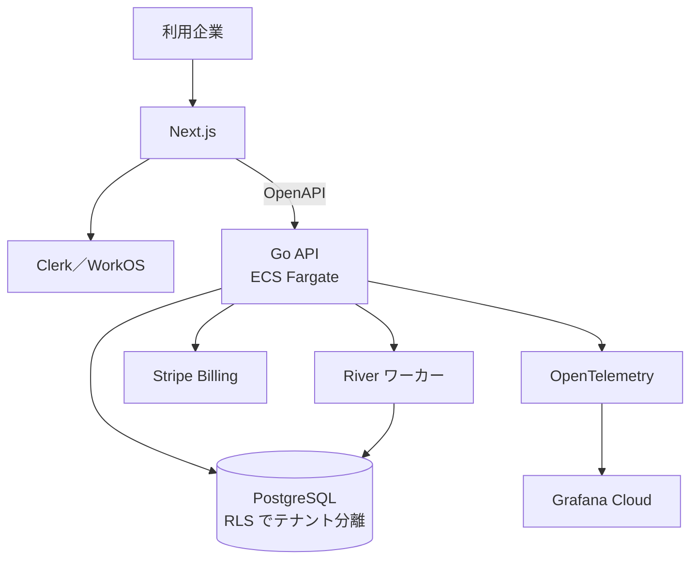

最初に決めること：マルチテナントの分離方式、SSO対応の時期、監査ログの範囲。

### 19-7. toCサービス（Web＋モバイル）

```stack
head: [レイヤー, 採用]
rows:
  - layer: Web
    pick: Next.js
    tools: [next-js]
  - layer: モバイル
    pick: React Native＋Expo（Expo Router、NativeWind）
    tools: [react-native, expo, expo-router, nativewind]
  - layer: バックエンド
    pick: Hono（またはGo）
    tools: [hono, go]
  - layer: DB・認証・ストレージ
    pick: Supabase（小〜中規模）／ RDS＋Clerk＋S3（中規模以上）
    tools: [supabase, rds, clerk, s3]
  - layer: プッシュ通知
    pick: FCM（Expo Notifications）
    tools: [fcm, expo-notifications]
  - layer: 画像・動画
    pick: Cloudflare Images／Cloudflare Stream
    tools: [cloudflare-images, cloudflare-stream]
  - layer: 分析
    pick: PostHog
    tools: [posthog]
  - layer: 配信
    pick: EAS Build／Submit／Update
    tools: [eas-build, eas-submit, eas-update]
```

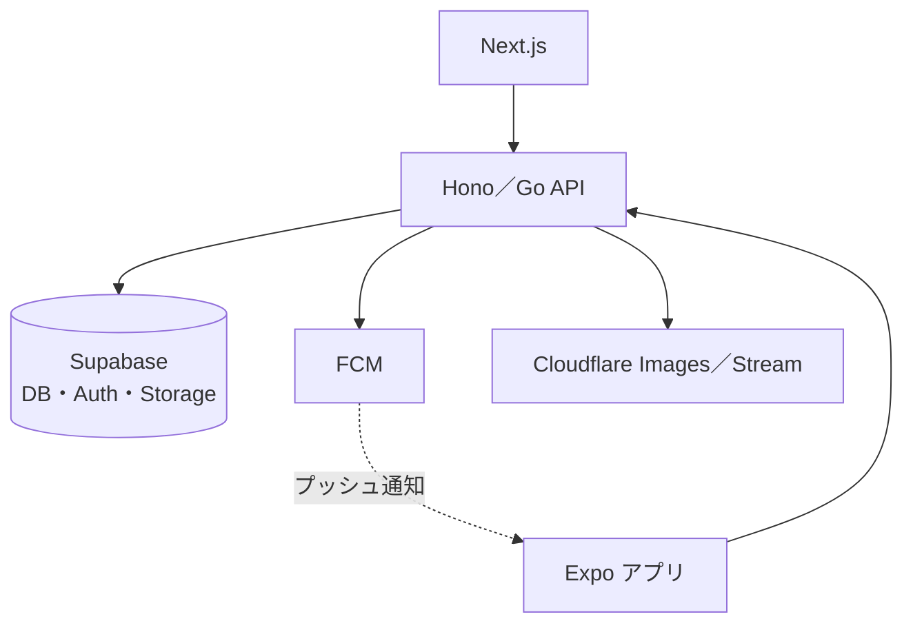

### 19-8. AI／LLMプロダクト

```stack
head: [レイヤー, 採用]
rows:
  - layer: フロント
    pick: Next.js（ストリーミング表示）
    tools: [next-js]
  - layer: AIバックエンド
    pick: LLM API呼び出し中心ならHono（TS）、埋め込み・ML処理があるならFastAPI（uv、Ruff、Pydantic）
    tools: [typescript, uv, ruff, pydantic]
  - layer: DB・ベクトル
    pick: PostgreSQL＋pgvector
    tools: [postgresql, pgvector]
  - layer: 長時間処理
    pick: Temporal、またはInngest
    tools: [temporal, inngest]
  - layer: 評価・トレース
    pick: Langfuse
    tools: [langfuse]
  - layer: 監視
    pick: Sentry＋OpenTelemetry
    tools: [sentry, opentelemetry]
```

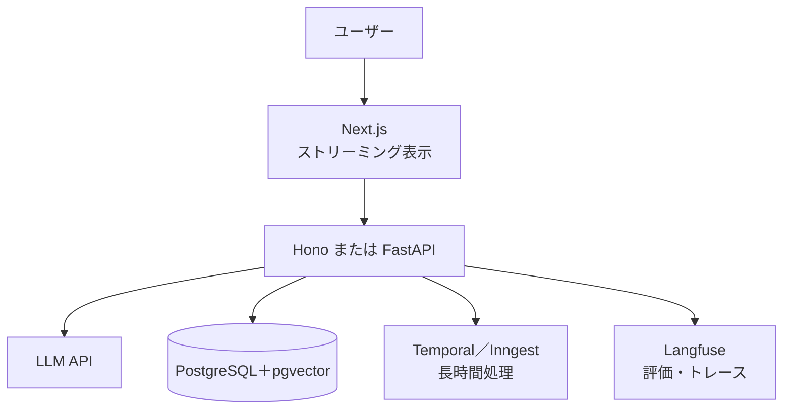

利用規約・データ取り扱い（学習への利用有無、保存リージョン）を利用者に説明できる状態にしておく。

### 19-9. リアルタイム系（チャット・通知・共同編集）

```stack
head: [規模・構成, 採用]
rows:
  - layer: Rails
    pick: Action Cable＋Solid Cable
    tools: [action-cable, solid-cable]
  - layer: TS・マネージド
    pick: Cloudflare Durable Objects
    tools: [cloudflare-durable-objects]
  - layer: TS・自前運用（AWS・オンプレ）
    pick: Node.js（WebSocket）＋Valkey Pub/Sub
    tools: [node-js, valkey]
  - layer: 同時接続が非常に多い・プレゼンスが必要
    pick: Elixir（Phoenix Channels＋Presence）
    tools: [elixir, phoenix-channels, phoenix-presence]
  - layer: 同時接続が多い（Elixirを採用しない場合）
    pick: Go（WebSocket）＋Valkey Pub/Sub
    tools: [go, valkey]
  - layer: 共同編集
    pick: Yjs（マネージドならLiveblocks）
    tools: [yjs, liveblocks]
  - layer: 片方向で足りる
    pick: Server-Sent Events
    tools: [server-sent-events]
```

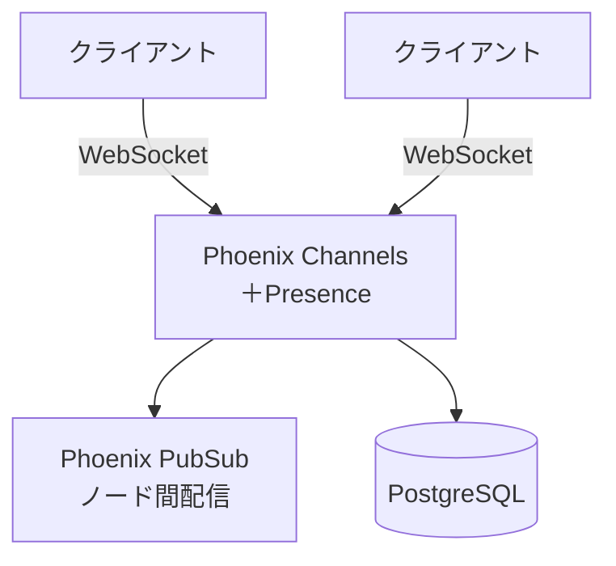

### 19-10. インフラツール・CLI

```stack
head: [レイヤー, 採用]
rows:
  - layer: 言語
    pick: Go（Cobra、slog）
    tools: [go, cobra, log-slog]
  - layer: 配布
    pick: GoReleaser（GitHub Releases、Homebrew tap）
    tools: [goreleaser, github-releases, homebrew]
  - layer: 性能が厳しい箇所
    pick: Rust（clap、Tokio）
    tools: [rust, clap, tokio]
```

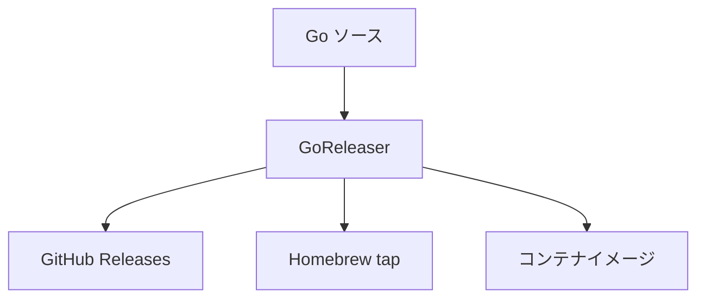

### 19-11. 個人開発・MVP

```stack
head: [パターン, 構成]
rows:
  - layer: TS全部入り
    pick: Next.js＋Supabase＋Vercel
    tools: [next-js, supabase, vercel]
  - layer: エッジ
    pick: Hono＋Cloudflare Workers＋D1／R2
    tools: [hono, cloudflare-workers, cloudflare-d1, cloudflare-r2]
  - layer: Railsワンマン
    pick: Rails＋SQLite＋Kamal＋VPS
    tools: [rails, sqlite, kamal]
  - layer: Go単体
    pick: Go＋PostgreSQL＋htmx
    tools: [go, postgresql, htmx]
```

PaaSは必ず支出上限を設定する。

### 19-12. 高トラフィック（セール・チケット販売）

```stack
head: [対策, 採用]
rows:
  - layer: 入場制御
    pick: Cloudflare Waiting Room
    tools: [cloudflare-waiting-room]
  - layer: 読み取り
    pick: 静的生成＋CDNキャッシュ
  - layer: 在庫・注文
    pick: SQSで直列化、在庫は行ロックまたは条件付きUPDATE
  - layer: DB
    pick: RDS Proxy＋リードレプリカ
    tools: [rds-proxy]
  - layer: 事前検証
    pick: k6で本番相当の負荷試験
    tools: [k6]
```

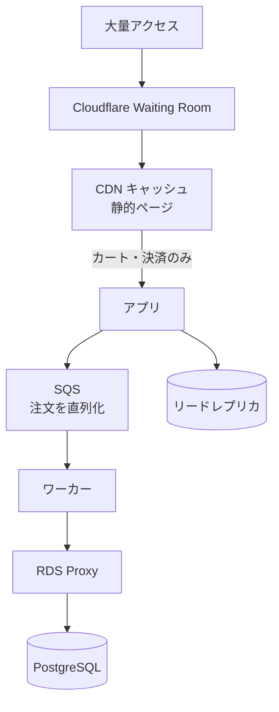

動的処理は「カート投入」と「決済」に絞り、それ以外はキャッシュから返す。

### 19-13. データ基盤・バッチ

```stack
head: [レイヤー, 採用]
rows:
  - layer: 集計
    pick: SQL（DuckDB、規模が大きければBigQuery）
    tools: [sql, duckdb, bigquery]
  - layer: 変換
    pick: Python＋Polars（uv、Ruff）
    tools: [python, polars, uv, ruff]
  - layer: ワークフロー
    pick: Temporal
    tools: [temporal]
  - layer: 実行
    pick: RenderのCron Job（AWSならECSのスケジュールタスク）
    tools: [render, ecs-on-fargate]
  - layer: 監視
    pick: Sentry（Cron Monitoringで実行漏れを検知）
    tools: [sentry]
```

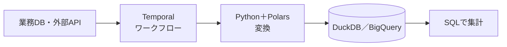

再実行・中断再開が必要な大規模バッチやストリーム処理は、変換をKotlin（Spring Batch／Kafka Streams）にする（§2-10 手順2）。

### 19-14. モバイルアプリ単体

```stack
head: [レイヤー, 採用]
rows:
  - layer: アプリ
    pick: React Native＋Expo（Expo Router、NativeWind）
    tools: [react-native, expo, expo-router, nativewind]
  - layer: DB・認証・ストレージ
    pick: Supabase
    tools: [supabase]
  - layer: プッシュ通知
    pick: FCM（Expo Notifications経由）
    tools: [fcm, expo-notifications]
  - layer: 配信
    pick: EAS Build／Submit／Update
    tools: [eas-build, eas-submit, eas-update]
  - layer: 分析
    pick: PostHog
    tools: [posthog]
  - layer: 監視
    pick: Sentry
    tools: [sentry]
```

Webの画面が必要になったら §19-7 に移る。Supabaseから離れるときは §24 に従う。
